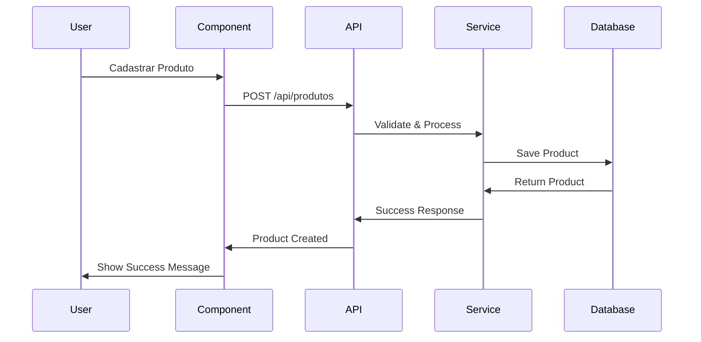

# Design Document - Sistema de Gestão de Produtos

## Overview

O Sistema de Gestão de Produtos será implementado como uma extensão do InterAlpha existente, aproveitando a arquitetura Next.js 15, Prisma ORM e PostgreSQL já estabelecida. O sistema seguirá os padrões de design já implementados no projeto, mantendo consistência visual e arquitetural.

A solução será composta por:
- **Frontend**: Componentes React com TypeScript e Tailwind CSS
- **Backend**: APIs REST com Next.js App Router
- **Banco de Dados**: Extensão do schema Prisma existente
- **Storage**: Upload de imagens com otimização automática
- **Validações**: Zod para validação de dados
- **UI/UX**: Componentes reutilizáveis do sistema de design existente

## Architecture

### Arquitetura Geral

```mermaid
graph TB
    subgraph "Frontend Layer"
        A[Página de Produtos] --> B[Componentes UI]
        B --> C[Formulários]
        B --> D[Listagem]
        B --> E[Modal de Detalhes]
    end
    
    subgraph "API Layer"
        F[/api/produtos] --> G[CRUD Operations]
        H[/api/produtos/upload] --> I[Image Upload]
        J[/api/produtos/search] --> K[Search & Filter]
    end
    
    subgraph "Business Logic"
        L[Product Service] --> M[Validation Logic]
        L --> N[Price Calculations]
        L --> O[Image Processing]
    end
    
    subgraph "Data Layer"
        P[(PostgreSQL)] --> Q[Produto Model]
        R[File Storage] --> S[Image Assets]
    end
    
    A --> F
    F --> L
    L --> P
    H --> R
```

### Fluxo de Dados



## Components and Interfaces

### Estrutura de Componentes

```
src/
├── app/
│   └── (dashboard)/
│       └── produtos/
│           ├── page.tsx                 # Listagem principal
│           ├── novo/
│           │   └── page.tsx            # Cadastro de produto
│           └── [id]/
│               ├── page.tsx            # Detalhes do produto
│               └── editar/
│                   └── page.tsx        # Edição de produto
├── components/
│   └── produtos/
│       ├── ProductCard.tsx             # Card de produto na listagem
│       ├── ProductForm.tsx             # Formulário de cadastro/edição
│       ├── ProductList.tsx             # Lista de produtos
│       ├── ProductSearch.tsx           # Busca e filtros
│       ├── ProductDetails.tsx          # Modal de detalhes
│       ├── ImageUpload.tsx             # Upload de imagens
│       ├── PriceCalculator.tsx         # Calculadora de margem
│       └── ProductActions.tsx          # Ações (editar, excluir)
├── lib/
│   └── services/
│       └── product-service.ts          # Lógica de negócio
└── types/
    └── product.ts                      # Tipos TypeScript
```

### Interfaces TypeScript

```typescript
// types/product.ts
export interface Product {
  id: string
  partNumber: string
  description: string
  costPrice: number
  salePrice: number
  profitMargin: number
  imageUrl?: string
  createdAt: Date
  updatedAt: Date
  createdBy: string
  isActive: boolean
}

export interface ProductFormData {
  partNumber: string
  description: string
  costPrice: number
  salePrice: number
  image?: File
}

export interface ProductFilters {
  search?: string
  sortBy?: 'partNumber' | 'description' | 'costPrice' | 'salePrice' | 'profitMargin'
  sortOrder?: 'asc' | 'desc'
  page?: number
  limit?: number
}

export interface ProductStats {
  totalProducts: number
  averageMargin: number
  totalValue: number
  lowStockCount: number
}
```

### Componentes Principais

#### 1. ProductForm Component

```typescript
interface ProductFormProps {
  product?: Product
  onSubmit: (data: ProductFormData) => Promise<void>
  onCancel: () => void
  isLoading?: boolean
}

export function ProductForm({ product, onSubmit, onCancel, isLoading }: ProductFormProps) {
  // Implementação do formulário com validações
  // Cálculo automático de margem
  // Upload de imagem com preview
  // Validação de part number único
}
```

#### 2. ProductCard Component

```typescript
interface ProductCardProps {
  product: Product
  onEdit: (id: string) => void
  onDelete: (id: string) => void
  onView: (id: string) => void
}

export function ProductCard({ product, onEdit, onDelete, onView }: ProductCardProps) {
  // Card responsivo com imagem
  // Informações principais do produto
  // Ações de editar/excluir/visualizar
  // Indicador visual de margem de lucro
}
```

#### 3. ProductList Component

```typescript
interface ProductListProps {
  products: Product[]
  filters: ProductFilters
  onFiltersChange: (filters: ProductFilters) => void
  isLoading?: boolean
}

export function ProductList({ products, filters, onFiltersChange, isLoading }: ProductListProps) {
  // Grid responsivo de produtos
  // Paginação
  // Estados de loading e empty
  // Integração com busca e filtros
}
```

## Data Models

### Extensão do Schema Prisma

```prisma
// Adicionar ao schema.prisma existente

model Product {
  id          String   @id @default(cuid())
  partNumber  String   @unique
  description String
  costPrice   Float
  salePrice   Float
  imageUrl    String?
  isActive    Boolean  @default(true)
  createdAt   DateTime @default(now())
  updatedAt   DateTime @updatedAt
  createdBy   String
  
  // Relacionamentos
  creator     User     @relation("ProductCreator", fields: [createdBy], references: [id])
  orderItems  OrderItem[]
  
  @@index([partNumber])
  @@index([description])
  @@index([isActive])
  @@index([createdAt])
  @@map("products")
}

model OrderItem {
  id         String  @id @default(cuid())
  orderId    String
  productId  String
  quantity   Int
  unitPrice  Float
  totalPrice Float
  
  order      OrdemServico @relation(fields: [orderId], references: [id])
  product    Product      @relation(fields: [productId], references: [id])
  
  @@map("order_items")
}

// Estender User model
model User {
  // ... campos existentes
  createdProducts Product[] @relation("ProductCreator")
}

// Estender OrdemServico model  
model OrdemServico {
  // ... campos existentes
  items OrderItem[]
}
```

### Campos Calculados

```typescript
// Campos virtuais calculados no frontend
interface ProductWithCalculations extends Product {
  profitMargin: number        // (salePrice - costPrice) / costPrice * 100
  profitAmount: number        // salePrice - costPrice
  marginStatus: 'positive' | 'negative' | 'zero'
  formattedCostPrice: string  // Formatação monetária
  formattedSalePrice: string  // Formatação monetária
}
```

## Error Handling

### Estratégias de Tratamento de Erros

#### 1. Validação de Dados

```typescript
// lib/validations/product.ts
import { z } from 'zod'

export const productSchema = z.object({
  partNumber: z.string()
    .min(1, 'Part number é obrigatório')
    .max(50, 'Part number deve ter no máximo 50 caracteres')
    .regex(/^[A-Za-z0-9-]+$/, 'Part number deve conter apenas letras, números e hífens'),
  
  description: z.string()
    .min(1, 'Descrição é obrigatória')
    .max(500, 'Descrição deve ter no máximo 500 caracteres'),
  
  costPrice: z.number()
    .positive('Preço de custo deve ser positivo')
    .max(999999.99, 'Preço de custo muito alto'),
  
  salePrice: z.number()
    .positive('Preço de venda deve ser positivo')
    .max(999999.99, 'Preço de venda muito alto'),
})

export const imageSchema = z.object({
  file: z.instanceof(File)
    .refine(file => file.size <= 5 * 1024 * 1024, 'Arquivo deve ter no máximo 5MB')
    .refine(file => ['image/jpeg', 'image/png', 'image/webp'].includes(file.type), 
            'Formato deve ser JPG, PNG ou WebP')
})
```

#### 2. Tratamento de Erros na API

```typescript
// app/api/produtos/route.ts
export async function POST(request: NextRequest) {
  try {
    const data = await request.json()
    
    // Validação com Zod
    const validatedData = productSchema.parse(data)
    
    // Verificar unicidade do part number
    const existingProduct = await prisma.product.findUnique({
      where: { partNumber: validatedData.partNumber }
    })
    
    if (existingProduct) {
      return NextResponse.json(
        { error: 'Part number já existe', code: 'DUPLICATE_PART_NUMBER' },
        { status: 409 }
      )
    }
    
    // Criar produto
    const product = await prisma.product.create({
      data: {
        ...validatedData,
        createdBy: userId
      }
    })
    
    return NextResponse.json({ success: true, data: product })
    
  } catch (error) {
    if (error instanceof z.ZodError) {
      return NextResponse.json(
        { error: 'Dados inválidos', details: error.errors },
        { status: 400 }
      )
    }
    
    console.error('Erro ao criar produto:', error)
    return NextResponse.json(
      { error: 'Erro interno do servidor' },
      { status: 500 }
    )
  }
}
```

#### 3. Tratamento de Erros no Frontend

```typescript
// components/produtos/ProductForm.tsx
export function ProductForm({ onSubmit }: ProductFormProps) {
  const [errors, setErrors] = useState<Record<string, string>>({})
  const [isSubmitting, setIsSubmitting] = useState(false)
  
  const handleSubmit = async (data: ProductFormData) => {
    try {
      setIsSubmitting(true)
      setErrors({})
      
      await onSubmit(data)
      
      toast.success('Produto cadastrado com sucesso!')
      
    } catch (error: any) {
      if (error.code === 'DUPLICATE_PART_NUMBER') {
        setErrors({ partNumber: 'Este part number já existe' })
      } else if (error.details) {
        // Erros de validação do Zod
        const fieldErrors: Record<string, string> = {}
        error.details.forEach((err: any) => {
          fieldErrors[err.path[0]] = err.message
        })
        setErrors(fieldErrors)
      } else {
        toast.error('Erro ao cadastrar produto. Tente novamente.')
      }
    } finally {
      setIsSubmitting(false)
    }
  }
  
  // Renderização do formulário com exibição de erros
}
```

## Testing Strategy

### Estrutura de Testes

```
src/
├── __tests__/
│   ├── components/
│   │   └── produtos/
│   │       ├── ProductForm.test.tsx
│   │       ├── ProductCard.test.tsx
│   │       └── ProductList.test.tsx
│   ├── api/
│   │   └── produtos/
│   │       ├── create.test.ts
│   │       ├── update.test.ts
│   │       └── delete.test.ts
│   └── services/
│       └── product-service.test.ts
```

### Tipos de Testes

#### 1. Testes Unitários

```typescript
// __tests__/components/produtos/ProductForm.test.tsx
import { render, screen, fireEvent, waitFor } from '@testing-library/react'
import { ProductForm } from '@/components/produtos/ProductForm'

describe('ProductForm', () => {
  it('should calculate profit margin automatically', async () => {
    const mockOnSubmit = jest.fn()
    
    render(<ProductForm onSubmit={mockOnSubmit} onCancel={() => {}} />)
    
    // Preencher preços
    fireEvent.change(screen.getByLabelText(/preço de custo/i), {
      target: { value: '100' }
    })
    fireEvent.change(screen.getByLabelText(/preço de venda/i), {
      target: { value: '150' }
    })
    
    // Verificar cálculo da margem
    await waitFor(() => {
      expect(screen.getByText('50%')).toBeInTheDocument()
    })
  })
  
  it('should validate part number uniqueness', async () => {
    // Teste de validação de part number único
  })
  
  it('should handle image upload', async () => {
    // Teste de upload de imagem
  })
})
```

#### 2. Testes de Integração

```typescript
// __tests__/api/produtos/create.test.ts
import { POST } from '@/app/api/produtos/route'
import { NextRequest } from 'next/server'

describe('/api/produtos POST', () => {
  it('should create product with valid data', async () => {
    const request = new NextRequest('http://localhost/api/produtos', {
      method: 'POST',
      body: JSON.stringify({
        partNumber: 'TEST-001',
        description: 'Produto de teste',
        costPrice: 100,
        salePrice: 150
      })
    })
    
    const response = await POST(request)
    const data = await response.json()
    
    expect(response.status).toBe(200)
    expect(data.success).toBe(true)
    expect(data.data.partNumber).toBe('TEST-001')
  })
  
  it('should reject duplicate part number', async () => {
    // Teste de rejeição de part number duplicado
  })
})
```

#### 3. Testes E2E

```typescript
// e2e/produtos.spec.ts
import { test, expect } from '@playwright/test'

test.describe('Gestão de Produtos', () => {
  test('should create, edit and delete product', async ({ page }) => {
    // Navegar para página de produtos
    await page.goto('/produtos')
    
    // Criar novo produto
    await page.click('text=Novo Produto')
    await page.fill('[name="partNumber"]', 'E2E-001')
    await page.fill('[name="description"]', 'Produto E2E')
    await page.fill('[name="costPrice"]', '100')
    await page.fill('[name="salePrice"]', '150')
    
    // Upload de imagem
    await page.setInputFiles('[name="image"]', 'test-image.jpg')
    
    // Salvar
    await page.click('text=Salvar')
    
    // Verificar criação
    await expect(page.locator('text=E2E-001')).toBeVisible()
    
    // Editar produto
    await page.click('[data-testid="edit-E2E-001"]')
    await page.fill('[name="salePrice"]', '200')
    await page.click('text=Salvar')
    
    // Verificar edição
    await expect(page.locator('text=100%')).toBeVisible() // Nova margem
    
    // Excluir produto
    await page.click('[data-testid="delete-E2E-001"]')
    await page.click('text=Confirmar')
    
    // Verificar exclusão
    await expect(page.locator('text=E2E-001')).not.toBeVisible()
  })
})
```

### Cobertura de Testes

- **Componentes**: 90%+ cobertura
- **APIs**: 95%+ cobertura  
- **Services**: 90%+ cobertura
- **Fluxos E2E**: Cenários críticos completos

### Ferramentas de Teste

- **Jest**: Testes unitários e integração
- **React Testing Library**: Testes de componentes
- **Playwright**: Testes E2E
- **MSW**: Mock de APIs para testes
- **Istanbul**: Cobertura de código

## Performance Considerations

### Otimizações de Performance

#### 1. Frontend Optimizations

```typescript
// Lazy loading de componentes
const ProductForm = lazy(() => import('@/components/produtos/ProductForm'))
const ProductDetails = lazy(() => import('@/components/produtos/ProductDetails'))

// Memoização de componentes pesados
const ProductCard = memo(({ product, onEdit, onDelete }: ProductCardProps) => {
  // Implementação do card
})

// Virtualização para listas grandes
import { FixedSizeList as List } from 'react-window'

function ProductList({ products }: ProductListProps) {
  const Row = ({ index, style }: { index: number, style: CSSProperties }) => (
    <div style={style}>
      <ProductCard product={products[index]} />
    </div>
  )
  
  return (
    <List
      height={600}
      itemCount={products.length}
      itemSize={200}
    >
      {Row}
    </List>
  )
}
```

#### 2. Image Optimization

```typescript
// lib/services/image-service.ts
import sharp from 'sharp'

export class ImageService {
  static async optimizeImage(file: File): Promise<Buffer> {
    const buffer = Buffer.from(await file.arrayBuffer())
    
    return sharp(buffer)
      .resize(800, 600, { 
        fit: 'inside',
        withoutEnlargement: true 
      })
      .jpeg({ quality: 85 })
      .toBuffer()
  }
  
  static async generateThumbnail(file: File): Promise<Buffer> {
    const buffer = Buffer.from(await file.arrayBuffer())
    
    return sharp(buffer)
      .resize(200, 200, { fit: 'cover' })
      .jpeg({ quality: 70 })
      .toBuffer()
  }
}
```

#### 3. Database Optimizations

```sql
-- Índices para performance
CREATE INDEX idx_products_part_number ON products(part_number);
CREATE INDEX idx_products_description_gin ON products USING gin(to_tsvector('portuguese', description));
CREATE INDEX idx_products_active_created ON products(is_active, created_at DESC);
CREATE INDEX idx_products_price_range ON products(cost_price, sale_price);

-- Query otimizada para busca
SELECT p.*, 
       (p.sale_price - p.cost_price) / p.cost_price * 100 as profit_margin
FROM products p 
WHERE p.is_active = true 
  AND (
    p.part_number ILIKE $1 
    OR to_tsvector('portuguese', p.description) @@ plainto_tsquery('portuguese', $1)
  )
ORDER BY p.created_at DESC 
LIMIT $2 OFFSET $3;
```

#### 4. Caching Strategy

```typescript
// lib/cache/product-cache.ts
import { Redis } from 'ioredis'

export class ProductCache {
  private redis = new Redis(process.env.REDIS_URL)
  
  async getProduct(id: string): Promise<Product | null> {
    const cached = await this.redis.get(`product:${id}`)
    return cached ? JSON.parse(cached) : null
  }
  
  async setProduct(product: Product): Promise<void> {
    await this.redis.setex(
      `product:${product.id}`, 
      3600, // 1 hora
      JSON.stringify(product)
    )
  }
  
  async invalidateProduct(id: string): Promise<void> {
    await this.redis.del(`product:${id}`)
  }
  
  async getProductList(filters: ProductFilters): Promise<Product[] | null> {
    const key = `products:${JSON.stringify(filters)}`
    const cached = await this.redis.get(key)
    return cached ? JSON.parse(cached) : null
  }
}
```

### Métricas de Performance

- **Time to First Byte (TTFB)**: < 200ms
- **First Contentful Paint (FCP)**: < 1.5s
- **Largest Contentful Paint (LCP)**: < 2.5s
- **Cumulative Layout Shift (CLS)**: < 0.1
- **First Input Delay (FID)**: < 100ms

### Monitoramento

```typescript
// lib/monitoring/performance.ts
export function trackPerformance(action: string, duration: number) {
  // Enviar métricas para serviço de monitoramento
  if (typeof window !== 'undefined') {
    window.gtag?.('event', 'timing_complete', {
      name: action,
      value: duration
    })
  }
}

// Hook para medir performance de componentes
export function usePerformanceTracking(componentName: string) {
  useEffect(() => {
    const startTime = performance.now()
    
    return () => {
      const duration = performance.now() - startTime
      trackPerformance(`${componentName}_render`, duration)
    }
  }, [componentName])
}
```

## Security Considerations

### Medidas de Segurança

#### 1. Validação e Sanitização

```typescript
// lib/security/validation.ts
import DOMPurify from 'isomorphic-dompurify'

export function sanitizeInput(input: string): string {
  return DOMPurify.sanitize(input.trim())
}

export function validatePartNumber(partNumber: string): boolean {
  // Apenas alfanuméricos e hífens
  return /^[A-Za-z0-9-]+$/.test(partNumber)
}

export function validateImageFile(file: File): boolean {
  const allowedTypes = ['image/jpeg', 'image/png', 'image/webp']
  const maxSize = 5 * 1024 * 1024 // 5MB
  
  return allowedTypes.includes(file.type) && file.size <= maxSize
}
```

#### 2. Autorização e Controle de Acesso

```typescript
// middleware/product-auth.ts
export async function checkProductPermission(
  userId: string, 
  action: 'create' | 'read' | 'update' | 'delete',
  productId?: string
): Promise<boolean> {
  const user = await prisma.user.findUnique({
    where: { id: userId },
    include: { roleAssignments: { include: { role: true } } }
  })
  
  if (!user) return false
  
  const permissions = user.roleAssignments
    .flatMap(ra => ra.role.permissions as string[])
  
  switch (action) {
    case 'create':
      return permissions.includes('products:create')
    case 'read':
      return permissions.includes('products:read')
    case 'update':
      return permissions.includes('products:update') || 
             (permissions.includes('products:update_own') && 
              await isProductOwner(userId, productId!))
    case 'delete':
      return permissions.includes('products:delete')
    default:
      return false
  }
}
```

#### 3. Upload Seguro de Imagens

```typescript
// lib/upload/secure-upload.ts
import { createHash } from 'crypto'
import path from 'path'

export class SecureUpload {
  static async uploadProductImage(file: File, productId: string): Promise<string> {
    // Validar arquivo
    if (!validateImageFile(file)) {
      throw new Error('Arquivo inválido')
    }
    
    // Gerar nome único
    const hash = createHash('sha256')
      .update(file.name + Date.now() + productId)
      .digest('hex')
    
    const extension = path.extname(file.name)
    const filename = `${hash}${extension}`
    
    // Otimizar imagem
    const optimizedBuffer = await ImageService.optimizeImage(file)
    
    // Upload para storage seguro
    const url = await this.uploadToStorage(optimizedBuffer, filename)
    
    return url
  }
  
  private static async uploadToStorage(buffer: Buffer, filename: string): Promise<string> {
    // Implementar upload para S3, Cloudinary, etc.
    // Com configurações de segurança adequadas
  }
}
```

#### 4. Auditoria de Ações

```typescript
// lib/audit/product-audit.ts
export async function auditProductAction(
  userId: string,
  action: string,
  productId: string,
  oldData?: any,
  newData?: any
): Promise<void> {
  await prisma.auditEntry.create({
    data: {
      userId,
      userType: 'employee',
      action: `product_${action}`,
      resource: 'product',
      resourceId: productId,
      oldData: oldData ? JSON.stringify(oldData) : null,
      newData: newData ? JSON.stringify(newData) : null,
      timestamp: new Date(),
      ipAddress: getClientIP(),
      userAgent: getUserAgent()
    }
  })
}
```

### Compliance e Privacidade

- **LGPD**: Logs de acesso e modificação de dados
- **SOX**: Trilha de auditoria completa
- **ISO 27001**: Controles de segurança implementados
- **Backup**: Estratégia de backup automático
- **Encryption**: Dados sensíveis criptografados

## Integration Points

### Integração com Sistema Existente

#### 1. Ordens de Serviço

```typescript
// Extensão do modelo de Ordem de Serviço
interface OrdemServicoWithProducts extends OrdemServico {
  items: OrderItem[]
  totalProducts: number
  totalProductsValue: number
}

// Componente para adicionar produtos à ordem
export function OrderProductSelector({ orderId, onProductsChange }: {
  orderId: string
  onProductsChange: (items: OrderItem[]) => void
}) {
  const [selectedProducts, setSelectedProducts] = useState<OrderItem[]>([])
  
  const addProduct = (product: Product, quantity: number) => {
    const item: OrderItem = {
      id: generateId(),
      orderId,
      productId: product.id,
      quantity,
      unitPrice: product.salePrice,
      totalPrice: product.salePrice * quantity,
      product
    }
    
    setSelectedProducts(prev => [...prev, item])
    onProductsChange([...selectedProducts, item])
  }
  
  // Interface para buscar e adicionar produtos
}
```

#### 2. Relatórios Financeiros

```typescript
// Extensão dos relatórios existentes
export async function getFinancialReportWithProducts(
  startDate: Date,
  endDate: Date
): Promise<FinancialReportWithProducts> {
  const orders = await prisma.ordemServico.findMany({
    where: {
      createdAt: { gte: startDate, lte: endDate }
    },
    include: {
      items: { include: { product: true } },
      pagamentos: true
    }
  })
  
  const productRevenue = orders.reduce((total, order) => {
    return total + order.items.reduce((itemTotal, item) => {
      return itemTotal + item.totalPrice
    }, 0)
  }, 0)
  
  const serviceRevenue = orders.reduce((total, order) => {
    return total + (order.valor || 0)
  }, 0)
  
  return {
    totalRevenue: productRevenue + serviceRevenue,
    productRevenue,
    serviceRevenue,
    productsSold: orders.flatMap(o => o.items).length,
    topProducts: getTopSellingProducts(orders)
  }
}
```

#### 3. Sistema de Notificações

```typescript
// Notificações relacionadas a produtos
export const productNotifications = {
  async notifyLowStock(product: Product): Promise<void> {
    await notificationService.send({
      type: 'low_stock_alert',
      title: 'Estoque Baixo',
      message: `Produto ${product.partNumber} com estoque baixo`,
      priority: 'high',
      category: 'inventory',
      data: { productId: product.id }
    })
  },
  
  async notifyPriceChange(product: Product, oldPrice: number): Promise<void> {
    await notificationService.send({
      type: 'price_change',
      title: 'Preço Alterado',
      message: `Preço do produto ${product.partNumber} alterado`,
      priority: 'medium',
      category: 'products',
      data: { 
        productId: product.id,
        oldPrice,
        newPrice: product.salePrice
      }
    })
  }
}
```

#### 4. Sistema de Auditoria

```typescript
// Integração com auditoria existente
export function setupProductAuditTriggers() {
  // Trigger para criação
  prisma.$use(async (params, next) => {
    if (params.model === 'Product' && params.action === 'create') {
      const result = await next(params)
      
      await auditProductAction(
        getCurrentUserId(),
        'create',
        result.id,
        null,
        result
      )
      
      return result
    }
    
    return next(params)
  })
  
  // Triggers similares para update e delete
}
```

### APIs de Integração

#### 1. API REST Completa

```typescript
// app/api/produtos/route.ts - CRUD completo
export async function GET(request: NextRequest) {
  // Listar produtos com filtros e paginação
}

export async function POST(request: NextRequest) {
  // Criar novo produto
}

// app/api/produtos/[id]/route.ts
export async function GET(request: NextRequest, { params }: { params: { id: string } }) {
  // Obter produto específico
}

export async function PUT(request: NextRequest, { params }: { params: { id: string } }) {
  // Atualizar produto
}

export async function DELETE(request: NextRequest, { params }: { params: { id: string } }) {
  // Excluir produto
}
```

#### 2. Webhooks para Integrações Externas

```typescript
// lib/webhooks/product-webhooks.ts
export class ProductWebhooks {
  static async triggerProductCreated(product: Product): Promise<void> {
    const webhookUrls = await getActiveWebhooks('product.created')
    
    for (const url of webhookUrls) {
      try {
        await fetch(url, {
          method: 'POST',
          headers: { 'Content-Type': 'application/json' },
          body: JSON.stringify({
            event: 'product.created',
            data: product,
            timestamp: new Date().toISOString()
          })
        })
      } catch (error) {
        console.error(`Webhook failed for ${url}:`, error)
      }
    }
  }
}
```

## Deployment Strategy

### Estratégia de Deploy

#### 1. Migrations do Banco de Dados

```sql
-- Migration: 001_create_products_table.sql
CREATE TABLE products (
  id VARCHAR(30) PRIMARY KEY,
  part_number VARCHAR(50) UNIQUE NOT NULL,
  description TEXT NOT NULL,
  cost_price DECIMAL(10,2) NOT NULL CHECK (cost_price >= 0),
  sale_price DECIMAL(10,2) NOT NULL CHECK (sale_price >= 0),
  image_url TEXT,
  is_active BOOLEAN DEFAULT true,
  created_at TIMESTAMP DEFAULT CURRENT_TIMESTAMP,
  updated_at TIMESTAMP DEFAULT CURRENT_TIMESTAMP,
  created_by VARCHAR(30) NOT NULL REFERENCES users(id)
);

CREATE INDEX idx_products_part_number ON products(part_number);
CREATE INDEX idx_products_description_gin ON products USING gin(to_tsvector('portuguese', description));
CREATE INDEX idx_products_active_created ON products(is_active, created_at DESC);

-- Migration: 002_create_order_items_table.sql
CREATE TABLE order_items (
  id VARCHAR(30) PRIMARY KEY,
  order_id VARCHAR(30) NOT NULL REFERENCES ordens_servico(id),
  product_id VARCHAR(30) NOT NULL REFERENCES products(id),
  quantity INTEGER NOT NULL CHECK (quantity > 0),
  unit_price DECIMAL(10,2) NOT NULL,
  total_price DECIMAL(10,2) NOT NULL,
  created_at TIMESTAMP DEFAULT CURRENT_TIMESTAMP
);

CREATE INDEX idx_order_items_order_id ON order_items(order_id);
CREATE INDEX idx_order_items_product_id ON order_items(product_id);
```

#### 2. Deploy Incremental

```typescript
// scripts/deploy-products.ts
export async function deployProductsFeature() {
  console.log('🚀 Iniciando deploy da funcionalidade de produtos...')
  
  // 1. Executar migrations
  await runMigrations()
  
  // 2. Verificar integridade do banco
  await verifyDatabaseIntegrity()
  
  // 3. Executar testes de integração
  await runIntegrationTests()
  
  // 4. Deploy dos componentes frontend
  await deployFrontendComponents()
  
  // 5. Ativar feature flag
  await enableFeatureFlag('products_management')
  
  console.log('✅ Deploy concluído com sucesso!')
}
```

#### 3. Feature Flags

```typescript
// lib/feature-flags.ts
export function useProductsFeature() {
  const { user } = useAuth()
  
  return useMemo(() => {
    // Verificar se usuário tem acesso à funcionalidade
    return user?.permissions?.includes('products:access') && 
           getFeatureFlag('products_management')
  }, [user])
}

// Componente condicional
export function ProductsNavItem() {
  const hasProductsAccess = useProductsFeature()
  
  if (!hasProductsAccess) return null
  
  return (
    <NavItem href="/produtos" icon={Package}>
      Produtos
    </NavItem>
  )
}
```

#### 4. Rollback Strategy

```typescript
// scripts/rollback-products.ts
export async function rollbackProductsFeature() {
  console.log('🔄 Iniciando rollback da funcionalidade de produtos...')
  
  // 1. Desativar feature flag
  await disableFeatureFlag('products_management')
  
  // 2. Backup dos dados
  await backupProductsData()
  
  // 3. Reverter migrations (se necessário)
  if (shouldRevertMigrations()) {
    await revertMigrations(['002_create_order_items_table', '001_create_products_table'])
  }
  
  // 4. Remover componentes frontend
  await removeProductsRoutes()
  
  console.log('✅ Rollback concluído!')
}
```

### Monitoramento Pós-Deploy

```typescript
// lib/monitoring/products-monitoring.ts
export function setupProductsMonitoring() {
  // Métricas de uso
  trackMetric('products.created.count')
  trackMetric('products.updated.count')
  trackMetric('products.deleted.count')
  trackMetric('products.search.performance')
  
  // Alertas de erro
  setupAlert('products.api.error_rate', { threshold: 5 })
  setupAlert('products.database.slow_queries', { threshold: 1000 })
  
  // Health checks
  registerHealthCheck('products.database', async () => {
    const count = await prisma.product.count()
    return { status: 'healthy', productCount: count }
  })
}
```

Este design document fornece uma base sólida para implementar o sistema de gestão de produtos de forma robusta, escalável e integrada ao sistema existente do InterAlpha.