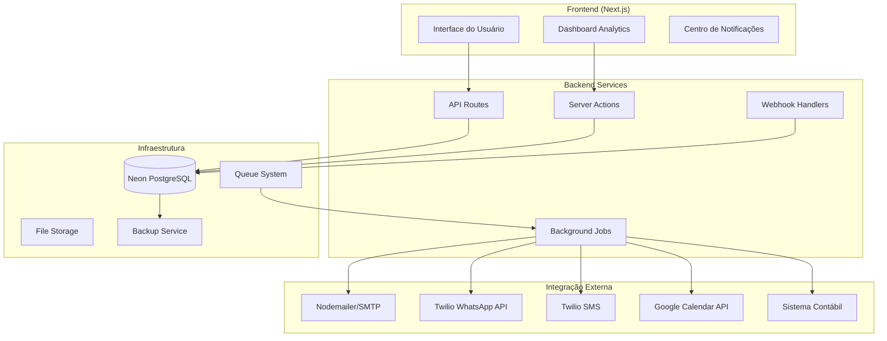

# Documento de Design - Integrações Avançadas

## Visão Geral

Este documento apresenta o design arquitetural para implementar integrações avançadas no sistema InterAlpha. O sistema será expandido com funcionalidades de automação, notificações, sincronizações e integrações com serviços externos, mantendo a arquitetura existente baseada em Next.js, Prisma e PostgreSQL (Neon).

## Arquitetura

### Arquitetura Geral



### Camadas de Integração

1. **Camada de Apresentação**: Interface React com componentes para configuração e monitoramento
2. **Camada de Serviços**: Server Actions e API Routes para lógica de negócio
3. **Camada de Integração**: Adaptadores para serviços externos
4. **Camada de Dados**: Extensões do schema Prisma para suportar novas funcionalidades
5. **Camada de Infraestrutura**: Serviços de background, filas e backup

## Componentes e Interfaces

### 1. Sistema de Notificações

#### Componentes Principais
- **NotificationService**: Serviço central para envio de notificações
- **EmailProvider**: Integração com Nodemailer para emails
- **SMSProvider**: Integração com Twilio para SMS
- **NotificationQueue**: Fila para processamento assíncrono
- **NotificationTemplate**: Sistema de templates para mensagens

#### Interfaces
```typescript
interface NotificationService {
  sendEmail(to: string, template: string, data: any): Promise<void>
  sendSMS(to: string, message: string): Promise<void>
  scheduleNotification(notification: Notification, delay: number): Promise<void>
}

interface NotificationTemplate {
  id: string
  type: 'email' | 'sms' | 'whatsapp'
  subject?: string
  body: string
  variables: string[]
}
```

### 2. Integração WhatsApp Business

#### Componentes Principais
- **WhatsAppService**: Cliente para Twilio WhatsApp API
- **MessageHandler**: Processamento de mensagens recebidas
- **ConversationTracker**: Rastreamento de conversas
- **WhatsAppWebhook**: Handler para webhooks do Twilio

#### Interfaces
```typescript
interface WhatsAppService {
  sendMessage(to: string, message: string): Promise<void>
  sendTemplate(to: string, templateName: string, params: any[]): Promise<void>
  handleIncomingMessage(webhook: WhatsAppWebhook): Promise<void>
}
```

### 3. Sincronização Contábil

#### Componentes Principais
- **AccountingSync**: Serviço de sincronização
- **AccountingAdapter**: Interface para diferentes sistemas contábeis
- **SyncQueue**: Fila para sincronização assíncrona
- **ConflictResolver**: Resolução de conflitos de dados

#### Interfaces
```typescript
interface AccountingAdapter {
  syncPayment(payment: Payment): Promise<SyncResult>
  syncInvoice(invoice: Invoice): Promise<SyncResult>
  handleConflict(conflict: DataConflict): Promise<Resolution>
}
```

### 4. Dashboard Analytics

#### Componentes Principais
- **AnalyticsEngine**: Motor de análise de dados
- **KPICalculator**: Cálculo de indicadores
- **ReportGenerator**: Geração de relatórios
- **ChartService**: Serviço para gráficos

#### Interfaces
```typescript
interface AnalyticsEngine {
  calculateKPIs(period: DateRange): Promise<KPIData>
  generateTrends(metric: string, period: DateRange): Promise<TrendData>
  exportReport(format: 'pdf' | 'excel', data: ReportData): Promise<Buffer>
}
```

### 5. Automação de Workflows

#### Componentes Principais
- **WorkflowEngine**: Motor de automação
- **RuleEngine**: Processamento de regras de negócio
- **ActionExecutor**: Execução de ações automatizadas
- **WorkflowScheduler**: Agendamento de workflows

#### Interfaces
```typescript
interface WorkflowEngine {
  executeWorkflow(trigger: WorkflowTrigger): Promise<void>
  scheduleWorkflow(workflow: Workflow, schedule: Schedule): Promise<void>
  evaluateRules(context: WorkflowContext): Promise<Action[]>
}
```

### 6. Integração com Calendário

#### Componentes Principais
- **CalendarService**: Integração com Google Calendar
- **EventSynchronizer**: Sincronização de eventos
- **ConflictDetector**: Detecção de conflitos de horário
- **AvailabilityChecker**: Verificação de disponibilidade

#### Interfaces
```typescript
interface CalendarService {
  createEvent(event: CalendarEvent): Promise<string>
  updateEvent(eventId: string, updates: Partial<CalendarEvent>): Promise<void>
  checkAvailability(timeSlot: TimeSlot): Promise<boolean>
  syncWithExternalCalendar(calendarId: string): Promise<void>
}
```

### 7. Sistema de Backup

#### Componentes Principais
- **BackupService**: Serviço de backup
- **BackupScheduler**: Agendamento de backups
- **BackupValidator**: Validação de integridade
- **RestoreService**: Serviço de restauração

#### Interfaces
```typescript
interface BackupService {
  createBackup(): Promise<BackupResult>
  scheduleBackup(schedule: BackupSchedule): Promise<void>
  validateBackup(backupId: string): Promise<ValidationResult>
  restoreFromBackup(backupId: string): Promise<RestoreResult>
}
```

### 8. API Externa

#### Componentes Principais
- **APIGateway**: Gateway para APIs externas
- **AuthenticationService**: Autenticação JWT
- **RateLimiter**: Limitação de taxa
- **APILogger**: Log de auditoria

#### Interfaces
```typescript
interface APIGateway {
  authenticate(token: string): Promise<User>
  rateLimit(clientId: string): Promise<boolean>
  logRequest(request: APIRequest): Promise<void>
  handleRequest(endpoint: string, data: any): Promise<APIResponse>
}
```

## Modelos de Dados

### Extensões do Schema Prisma

```prisma
// Notificações
model Notification {
  id          String   @id @default(cuid())
  type        NotificationType
  recipient   String
  subject     String?
  message     String
  status      NotificationStatus
  sentAt      DateTime?
  createdAt   DateTime @default(now())
  updatedAt   DateTime @updatedAt
  
  // Relacionamentos
  ordemServicoId String?
  ordemServico   OrdemServico? @relation(fields: [ordemServicoId], references: [id])
  pagamentoId    String?
  pagamento      Pagamento? @relation(fields: [pagamentoId], references: [id])
}

// Conversas WhatsApp
model WhatsAppConversation {
  id          String   @id @default(cuid())
  phoneNumber String
  clienteId   String?
  cliente     Cliente? @relation(fields: [clienteId], references: [id])
  status      ConversationStatus
  createdAt   DateTime @default(now())
  updatedAt   DateTime @updatedAt
  
  messages    WhatsAppMessage[]
}

model WhatsAppMessage {
  id             String   @id @default(cuid())
  conversationId String
  conversation   WhatsAppConversation @relation(fields: [conversationId], references: [id])
  direction      MessageDirection
  content        String
  messageType    MessageType
  twilioSid      String?
  sentAt         DateTime
  createdAt      DateTime @default(now())
}

// Sincronização Contábil
model AccountingSync {
  id          String   @id @default(cuid())
  entityType  String   // 'payment', 'invoice', etc.
  entityId    String
  externalId  String?
  status      SyncStatus
  lastSyncAt  DateTime?
  errorMessage String?
  createdAt   DateTime @default(now())
  updatedAt   DateTime @updatedAt
}

// Workflows
model Workflow {
  id          String   @id @default(cuid())
  name        String
  description String?
  trigger     Json     // Configuração do trigger
  actions     Json     // Ações a serem executadas
  isActive    Boolean  @default(true)
  createdAt   DateTime @default(now())
  updatedAt   DateTime @updatedAt
  
  executions  WorkflowExecution[]
}

model WorkflowExecution {
  id         String   @id @default(cuid())
  workflowId String
  workflow   Workflow @relation(fields: [workflowId], references: [id])
  status     ExecutionStatus
  startedAt  DateTime
  completedAt DateTime?
  errorMessage String?
  context    Json     // Contexto da execução
}

// Backups
model Backup {
  id          String   @id @default(cuid())
  filename    String
  size        BigInt
  checksum    String
  status      BackupStatus
  createdAt   DateTime @default(now())
  validatedAt DateTime?
}

// API Logs
model APILog {
  id         String   @id @default(cuid())
  endpoint   String
  method     String
  clientId   String?
  statusCode Int
  responseTime Int
  createdAt  DateTime @default(now())
}

// Enums
enum NotificationType {
  EMAIL
  SMS
  WHATSAPP
  PUSH
}

enum NotificationStatus {
  PENDING
  SENT
  DELIVERED
  FAILED
}

enum ConversationStatus {
  ACTIVE
  CLOSED
  ARCHIVED
}

enum MessageDirection {
  INBOUND
  OUTBOUND
}

enum MessageType {
  TEXT
  MEDIA
  TEMPLATE
}

enum SyncStatus {
  PENDING
  SUCCESS
  FAILED
  CONFLICT
}

enum ExecutionStatus {
  RUNNING
  SUCCESS
  FAILED
  CANCELLED
}

enum BackupStatus {
  CREATING
  COMPLETED
  FAILED
  VALIDATED
}
```

## Tratamento de Erros

### Estratégias de Erro

1. **Retry com Backoff Exponencial**: Para falhas temporárias de rede
2. **Circuit Breaker**: Para proteger contra falhas em cascata
3. **Fallback**: Mecanismos alternativos quando serviços falham
4. **Dead Letter Queue**: Para mensagens que falharam múltiplas vezes

### Implementação

```typescript
class ErrorHandler {
  async handleNotificationError(error: Error, notification: Notification) {
    if (error instanceof NetworkError) {
      await this.retryWithBackoff(notification)
    } else if (error instanceof ValidationError) {
      await this.logError(error, notification)
    } else {
      await this.sendToDeadLetterQueue(notification)
    }
  }
}
```

## Estratégia de Testes

### Tipos de Teste

1. **Testes Unitários**: Para lógica de negócio individual
2. **Testes de Integração**: Para comunicação entre serviços
3. **Testes End-to-End**: Para fluxos completos de usuário
4. **Testes de Carga**: Para performance sob stress

### Ferramentas

- **Jest**: Framework de testes
- **Supertest**: Testes de API
- **Playwright**: Testes E2E
- **MSW**: Mock de APIs externas

### Estrutura de Testes

```typescript
describe('NotificationService', () => {
  it('should send email notification successfully', async () => {
    const mockEmailProvider = jest.fn()
    const service = new NotificationService(mockEmailProvider)
    
    await service.sendEmail('test@example.com', 'welcome', { name: 'João' })
    
    expect(mockEmailProvider).toHaveBeenCalledWith({
      to: 'test@example.com',
      subject: 'Bem-vindo',
      body: expect.stringContaining('João')
    })
  })
})
```

## Considerações de Segurança

### Medidas de Segurança

1. **Autenticação JWT**: Para APIs externas
2. **Rate Limiting**: Proteção contra abuso
3. **Validação de Input**: Sanitização de dados
4. **Criptografia**: Para dados sensíveis
5. **Audit Logs**: Rastreamento de ações

### Implementação

```typescript
class SecurityService {
  validateJWT(token: string): Promise<User>
  encryptSensitiveData(data: string): string
  logSecurityEvent(event: SecurityEvent): Promise<void>
  checkRateLimit(clientId: string): Promise<boolean>
}
```

## Performance e Escalabilidade

### Otimizações

1. **Caching**: Redis para dados frequentemente acessados
2. **Queue System**: Bull/BullMQ para processamento assíncrono
3. **Database Indexing**: Índices otimizados para consultas
4. **Connection Pooling**: Pool de conexões do Prisma

### Monitoramento

1. **Métricas de Performance**: Tempo de resposta, throughput
2. **Health Checks**: Verificação de saúde dos serviços
3. **Alertas**: Notificações para problemas críticos
4. **Dashboards**: Visualização de métricas em tempo real

## Configuração e Deploy

### Variáveis de Ambiente

```env
# Notificações
SMTP_HOST=smtp.gmail.com
SMTP_PORT=587
SMTP_USER=noreply@interalpha.com
SMTP_PASS=app_password

# Twilio
TWILIO_ACCOUNT_SID=ACxxxxx
TWILIO_AUTH_TOKEN=xxxxx
TWILIO_WHATSAPP_NUMBER=+14155238886

# Google Calendar
GOOGLE_CLIENT_ID=xxxxx
GOOGLE_CLIENT_SECRET=xxxxx
GOOGLE_REDIRECT_URI=http://localhost:3000/auth/google/callback

# Sistema Contábil
ACCOUNTING_API_URL=https://api.contabil.com
ACCOUNTING_API_KEY=xxxxx

# Redis (Queue)
REDIS_URL=redis://localhost:6379

# Backup
BACKUP_STORAGE_PATH=/backups
BACKUP_RETENTION_DAYS=30
```

### Docker Configuration

```dockerfile
# Adicionar ao Dockerfile existente
RUN apt-get update && apt-get install -y \
    redis-server \
    cron

COPY scripts/backup.sh /usr/local/bin/
RUN chmod +x /usr/local/bin/backup.sh

# Configurar cron para backups
RUN echo "0 2 * * * /usr/local/bin/backup.sh" | crontab -
```

## Migração e Rollback

### Estratégia de Migração

1. **Migração Incremental**: Implementação por fases
2. **Feature Flags**: Controle de funcionalidades
3. **Blue-Green Deployment**: Deploy sem downtime
4. **Rollback Plan**: Plano de reversão

### Fases de Implementação

1. **Fase 1**: Sistema de notificações básico
2. **Fase 2**: Integração WhatsApp
3. **Fase 3**: Dashboard analytics
4. **Fase 4**: Automação de workflows
5. **Fase 5**: Integrações avançadas (calendário, contábil)
6. **Fase 6**: Sistema de backup e API externa