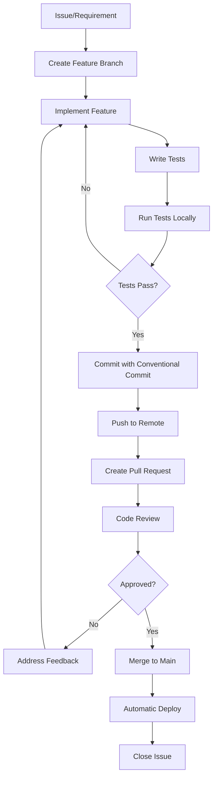
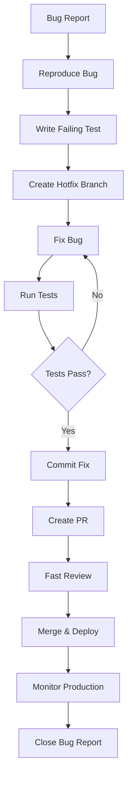

# 📋 Análise de Diretrizes de Desenvolvimento - InterAlpha App

**Data:** 14 de outubro de 2025  
**Status:** Documento de Referência Permanente

---

## 🎯 Objetivo deste Documento

Este documento consolida as **diretrizes, padrões e práticas** estabelecidas nos arquivos de referência:
- **AGENTS.md** - Playbooks de agentes especializados
- **docs.md** - Documentação técnica e arquitetural
- **Plans.md** - Protocolos de execução e planejamento

**USO OBRIGATÓRIO:** Todas as alterações no código devem seguir estas diretrizes.

---

## 📚 Estrutura de Referência

### 1. AGENTS.md - Agentes Especializados

#### Agentes Disponíveis:
1. **Code Reviewer** - Revisão de código
2. **Bug Fixer** - Análise e correção de bugs
3. **Feature Developer** - Implementação de funcionalidades
4. **Refactoring Specialist** - Melhorias e refatoração
5. **Test Writer** - Testes unitários e integração
6. **Documentation Writer** - Documentação técnica
7. **Performance Optimizer** - Otimização de performance
8. **Security Auditor** - Auditoria de segurança
9. **Backend Specialist** - Arquitetura server-side
10. **Frontend Specialist** - Interfaces de usuário
11. **Architect Specialist** - Arquitetura do sistema
12. **DevOps Specialist** - CI/CD e infraestrutura
13. **Database Specialist** - Schemas e otimização
14. **Mobile Specialist** - Aplicações mobile

#### Como Usar:
1. Identificar o tipo de tarefa
2. Selecionar o agente apropriado
3. Seguir o playbook específico
4. Documentar decisões e aprendizados

---

### 2. docs.md - Documentação Técnica

#### Documentos Principais:

##### **project-overview.md**
- **Objetivo:** Visão geral do sistema InterAlpha App
- **Conteúdo:**
  - Problema e solução
  - Stack tecnológico
  - Estrutura de arquivos
  - Quick facts

##### **architecture.md**
- **Objetivo:** Arquitetura do sistema
- **Conteúdo:**
  - Arquitetura monolítica modular
  - Camadas do sistema (Frontend, API, Serviços, Data)
  - Componentes principais
  - Integrações externas

##### **development-workflow.md**
- **Objetivo:** Fluxo de desenvolvimento
- **Conteúdo:**
  - Branching strategy (trunk-based)
  - Conventional commits
  - Code review process
  - Comandos principais

##### **testing-strategy.md**
- **Objetivo:** Estratégia de testes
- **Conteúdo:**
  - Tipos de testes (unitário, integração, E2E)
  - Ferramentas (Jest, Cypress)
  - Cobertura mínima (>70%)

##### **glossary.md**
- **Objetivo:** Termos e conceitos do domínio
- **Conteúdo:**
  - Terminologia de negócio
  - Regras de domínio
  - Personas de usuário

##### **data-flow.md**
- **Objetivo:** Fluxo de dados e integrações
- **Conteúdo:**
  - Diagramas de fluxo
  - Integrações externas
  - WebSockets e real-time

##### **security.md**
- **Objetivo:** Segurança e compliance
- **Conteúdo:**
  - Modelo de autenticação
  - Gestão de secrets
  - RLS (Row Level Security)

##### **tooling.md**
- **Objetivo:** Ferramentas e produtividade
- **Conteúdo:**
  - CLIs e scripts
  - Configurações de IDE
  - Workflows de automação

---

### 3. Plans.md - Protocolos de Execução

#### Protocolo de Execução de Agentes:

1. **Ler a fila** de cima para baixo (prioridade numérica)
2. **Abrir o plano** e revisar YAML front matter
3. **Coletar contexto** visitando documentação e playbooks
4. **Executar os estágios** conforme escrito
5. **Documentar resultados** na seção "Evidence & Follow-up"
6. **Retornar aqui** e pegar próximo plano

#### Criação de Planos:
- `ai-context plan <name>` - Scaffold de novo plano
- `ai-context plan <name> --fill` - Atualizar com contexto atual
- Cross-link com documentação e agentes

---

## 🏗️ Arquitetura do Sistema

### Visão Geral
```
┌─────────────────────────────────────────────────────────────┐
│                    FRONTEND LAYER                           │
│  Next.js 15 App Router + React 19 + TypeScript             │
│  Components: shadcn/ui + Custom Business Components         │
└─────────────────┬───────────────────────────────────────────┘
                  │
                  ▼
┌─────────────────────────────────────────────────────────────┐
│                    MIDDLEWARE LAYER                         │
│  Authentication (Supabase Auth) + Authorization (RLS)       │
│  Request Validation + Rate Limiting                         │
└─────────────────┬───────────────────────────────────────────┘
                  │
                  ▼
┌─────────────────────────────────────────────────────────────┐
│                    API LAYER                                │
│  Next.js API Routes (RESTful)                               │
│  Organized by domain: /clientes, /ordens-servico, etc      │
└─────────────────┬───────────────────────────────────────────┘
                  │
                  ▼
┌─────────────────────────────────────────────────────────────┐
│                    SERVICE LAYER                            │
│  Business Logic: EmailService, SMSService, PDFGenerator     │
│  Validations: Zod schemas + Custom validators               │
└─────────────────┬───────────────────────────────────────────┘
                  │
                  ▼
┌─────────────────────────────────────────────────────────────┐
│                    DATA LAYER                               │
│  Prisma ORM + Supabase PostgreSQL                           │
│  RLS Policies + Database Functions + Triggers               │
└─────────────────┬───────────────────────────────────────────┘
                  │
                  ▼
┌─────────────────────────────────────────────────────────────┐
│                    EXTERNAL INTEGRATIONS                    │
│  Stripe, Twilio, WhatsApp, Google APIs, ViaCEP, ReceitaWS  │
└─────────────────────────────────────────────────────────────┘
```

### Padrões Arquiteturais

#### 1. **Monolito Modular**
- Single codebase com separação clara de responsabilidades
- Módulos organizados por domínio de negócio
- Comunicação entre módulos via interfaces bem definidas

#### 2. **Trunk-Based Development**
- Branch principal: `main` (sempre deployável)
- Feature branches de curta duração
- CI/CD automático após merge

#### 3. **Component-Based Architecture**
- Componentes reutilizáveis com shadcn/ui
- Separação UI/Business Logic
- Props tipadas com TypeScript

#### 4. **Service Layer Pattern**
- Lógica de negócio centralizada em services
- Reutilização entre API routes
- Facilita testes unitários

---

## 📝 Convenções de Código

### Commits (Conventional Commits)

```bash
# Formato
<type>(<scope>): <description>

# Tipos permitidos:
feat:     # Nova funcionalidade
fix:      # Correção de bug
docs:     # Documentação
test:     # Testes
refactor: # Refatoração
perf:     # Performance
chore:    # Manutenção
style:    # Formatação

# Exemplos:
feat(ordens-servico): adicionar filtro por status
fix(clientes): corrigir validação de CPF/CNPJ
docs(api): atualizar documentação de endpoints
test(services): adicionar testes para PDFGenerator
refactor(components): melhorar estrutura do Dashboard
```

### Estrutura de Arquivos

```
interalpha-app/
├── app/                          # Next.js App Router
│   ├── api/                      # API Routes (RESTful)
│   │   ├── clientes/            # CRUD de clientes
│   │   ├── ordens-servico/      # CRUD de OS
│   │   ├── pecas/               # CRUD de peças
│   │   └── [domain]/            # Outros domínios
│   ├── dashboard/               # Interface principal
│   │   ├── clientes/
│   │   ├── ordens-servico/
│   │   └── [module]/
│   ├── auth/                    # Autenticação
│   ├── portal/                  # Portal do cliente
│   └── admin/                   # Administração
├── components/                   # Componentes React
│   ├── ui/                      # shadcn/ui base components
│   ├── dashboard/               # Componentes específicos
│   ├── auth/                    # Autenticação
│   └── [domain]/                # Por domínio
├── lib/                         # Utilitários e Services
│   ├── services/                # Business Logic
│   │   ├── email-service.ts
│   │   ├── sms-service.ts
│   │   ├── pdf-generator.ts
│   │   └── [service].ts
│   ├── validators.ts            # Validações
│   ├── utils.ts                 # Funções auxiliares
│   └── auth.ts                  # Config de auth
├── hooks/                       # Custom React Hooks
├── types/                       # TypeScript types
├── __tests__/                   # Testes
│   ├── api/                     # Testes de API
│   ├── components/              # Testes de componentes
│   ├── integration/             # Testes de integração
│   └── services/                # Testes de services
├── prisma/                      # Database schema
├── supabase/                    # Supabase config
├── public/                      # Assets estáticos
└── docs/                        # Documentação
```

### Nomenclatura

#### Arquivos
- **Componentes React:** PascalCase (`ServiceOrderForm.tsx`)
- **Páginas Next.js:** kebab-case (`ordens-servico/page.tsx`)
- **Services:** kebab-case (`email-service.ts`)
- **Utils:** kebab-case (`format-currency.ts`)
- **Types:** kebab-case (`ordem-servico.types.ts`)

#### Variáveis e Funções
```typescript
// Variáveis: camelCase
const clienteNome = 'João Silva';
const ordensServico = [];

// Funções: camelCase, verbos no infinitivo
function buscarCliente(id: string) {}
async function criarOrdemServico(data: OS) {}

// Componentes: PascalCase
function ServiceOrderList() {}
const ClienteForm = () => {};

// Constantes: UPPER_SNAKE_CASE
const MAX_UPLOAD_SIZE = 5 * 1024 * 1024;
const API_BASE_URL = process.env.NEXT_PUBLIC_API_URL;

// Types/Interfaces: PascalCase
interface OrdemServico {}
type ClienteStatus = 'ativo' | 'inativo';
```

---

## ✅ Checklist de Code Review

### Funcionalidade
- [ ] O código faz o que deveria fazer?
- [ ] Casos edge foram considerados?
- [ ] Validações de entrada estão presentes?
- [ ] Tratamento de erros está adequado?

### Testes
- [ ] Testes unitários adicionados/atualizados?
- [ ] Testes de integração quando necessário?
- [ ] Cobertura de código > 70%?
- [ ] Todos os testes passando?

### Segurança
- [ ] Validação de entrada em todos os endpoints?
- [ ] Autorização verificada (RLS, middleware)?
- [ ] Dados sensíveis não expostos em logs?
- [ ] Secrets não commitados no código?

### Performance
- [ ] Queries otimizadas (evitar N+1)?
- [ ] Componentes React otimizados (memo, callback)?
- [ ] Imagens otimizadas?
- [ ] Bundle size considerado?

### Padrões
- [ ] Segue convenções do projeto?
- [ ] ESLint sem erros/warnings?
- [ ] TypeScript strict mode respeitado?
- [ ] Formatação com Prettier?

### Documentação
- [ ] Código complexo documentado com comentários?
- [ ] JSDoc em funções públicas?
- [ ] README atualizado se necessário?
- [ ] CHANGELOG atualizado?

### Acessibilidade
- [ ] Componentes UI acessíveis (ARIA)?
- [ ] Navegação por teclado funcional?
- [ ] Contraste de cores adequado?
- [ ] Textos alternativos em imagens?

---

## 🧪 Estratégia de Testes

### Pirâmide de Testes

```
              ╱╲
             ╱  ╲
            ╱ E2E╲         10% - Testes End-to-End (Cypress)
           ╱──────╲
          ╱        ╲
         ╱Integration╲   20% - Testes de Integração (Jest)
        ╱────────────╲
       ╱              ╲
      ╱  Unit Tests    ╲  70% - Testes Unitários (Jest)
     ╱──────────────────╲
```

### Tipos de Testes

#### 1. **Testes Unitários (70%)**
- **Localização:** `__tests__/[module]/`
- **Framework:** Jest + React Testing Library
- **O que testar:**
  - Funções puras e utilitários
  - Componentes individuais
  - Services e validações
  - Hooks customizados

```typescript
// Exemplo: __tests__/services/pdf-generator.test.ts
import { PDFGenerator } from '@/lib/services/pdf-generator';

describe('PDFGenerator', () => {
  it('deve gerar PDF com dados válidos', async () => {
    const generator = new PDFGenerator();
    const pdf = await generator.generateOrdemServicoPDF(mockOS);
    expect(pdf).toBeInstanceOf(Buffer);
  });
});
```

#### 2. **Testes de Integração (20%)**
- **Localização:** `__tests__/integration/`
- **Framework:** Jest + Supertest
- **O que testar:**
  - API endpoints completos
  - Fluxo entre camadas
  - Integrações com banco de dados
  - Comunicação entre services

```typescript
// Exemplo: __tests__/integration/api/ordens-servico.test.ts
describe('POST /api/ordens-servico', () => {
  it('deve criar OS e enviar notificações', async () => {
    const response = await request(app)
      .post('/api/ordens-servico')
      .send(validOSData);
    
    expect(response.status).toBe(201);
    expect(emailService.send).toHaveBeenCalled();
  });
});
```

#### 3. **Testes E2E (10%)**
- **Localização:** `cypress/e2e/`
- **Framework:** Cypress
- **O que testar:**
  - Fluxos críticos de usuário
  - Jornada completa (login → ação → resultado)
  - Interações complexas de UI

```typescript
// Exemplo: cypress/e2e/criar-ordem-servico.cy.ts
describe('Criar Ordem de Serviço', () => {
  it('deve criar OS completa do início ao fim', () => {
    cy.login('admin@test.com', 'password');
    cy.visit('/dashboard/ordens-servico');
    cy.get('[data-testid="novo-os-btn"]').click();
    // ... preencher formulário
    cy.get('[data-testid="salvar-btn"]').click();
    cy.contains('Ordem de Serviço criada com sucesso');
  });
});
```

### Comandos de Teste

```bash
# Testes unitários
npm run test                  # Executa todos os testes
npm run test:watch            # Modo watch
npm run test:coverage         # Com cobertura
npm run test -- --silent      # Sem logs

# Testes específicos
npm run test -- clientes      # Testa módulo de clientes
npm run test -- pdf-generator # Testa PDFGenerator

# Testes E2E
npm run test:e2e             # Executa Cypress
npm run test:e2e:headless    # Sem interface

# Qualidade
npm run type-check           # TypeScript
npm run lint                 # ESLint
npm run format               # Prettier
```

### Metas de Cobertura

- **Global:** >70%
- **Services:** >80%
- **Components:** >60%
- **Utils:** >90%

---

## 🔒 Segurança

### Autenticação e Autorização

#### Supabase Auth
```typescript
// Middleware de autenticação (middleware.ts)
export async function middleware(request: NextRequest) {
  const { supabase, response } = createClient(request);
  const { data: { user } } = await supabase.auth.getUser();
  
  if (!user && isProtectedRoute(request.nextUrl.pathname)) {
    return NextResponse.redirect(new URL('/auth/login', request.url));
  }
  
  return response;
}
```

#### RLS (Row Level Security)
```sql
-- Exemplo: Políticas de segurança para ordens_servico
CREATE POLICY "Usuários veem apenas suas OS"
  ON ordens_servico
  FOR SELECT
  USING (
    auth.uid() = user_id OR
    EXISTS (
      SELECT 1 FROM usuarios
      WHERE id = auth.uid() AND role = 'admin'
    )
  );
```

### Validação de Dados

#### Zod Schemas
```typescript
// lib/validators.ts
import { z } from 'zod';

export const ordemServicoSchema = z.object({
  cliente_id: z.string().uuid('ID do cliente inválido'),
  descricao: z.string().min(10, 'Descrição muito curta'),
  valor_servico: z.number().positive('Valor deve ser positivo'),
  status: z.enum(['aberta', 'em_andamento', 'concluida']),
});

// Uso em API route
export async function POST(request: Request) {
  const body = await request.json();
  const validated = ordemServicoSchema.parse(body); // Throws se inválido
  // ... continuar
}
```

### Gestão de Secrets

```bash
# .env.local (NUNCA commitar!)
NEXT_PUBLIC_SUPABASE_URL=https://xxx.supabase.co
SUPABASE_SERVICE_ROLE_KEY=eyJxxx # SECRETO
SMTP_HOST=smtp.gmail.com
SMTP_USER=noreply@interalpha.com
SMTP_PASS=xxx # SECRETO

# .env.example (pode commitar)
NEXT_PUBLIC_SUPABASE_URL=
SUPABASE_SERVICE_ROLE_KEY=
SMTP_HOST=
SMTP_USER=
SMTP_PASS=
```

---

## 🚀 Performance

### Otimizações Frontend

#### 1. **Code Splitting**
```typescript
// Dynamic imports para reduzir bundle inicial
import dynamic from 'next/dynamic';

const PDFViewer = dynamic(() => import('@/components/PDFViewer'), {
  loading: () => <Skeleton />,
  ssr: false,
});
```

#### 2. **Memoization**
```typescript
import { memo, useMemo, useCallback } from 'react';

// Componentes
export const ClienteCard = memo(({ cliente }) => {
  return <div>{cliente.nome}</div>;
});

// Cálculos pesados
const totalValue = useMemo(() => {
  return orders.reduce((sum, o) => sum + o.valor, 0);
}, [orders]);

// Callbacks
const handleSubmit = useCallback((data) => {
  submitForm(data);
}, [submitForm]);
```

#### 3. **Image Optimization**
```typescript
import Image from 'next/image';

<Image
  src="/logo.png"
  width={200}
  height={100}
  alt="Logo"
  priority // Above the fold
/>
```

### Otimizações Backend

#### 1. **Database Queries**
```typescript
// ❌ N+1 Problem
const orders = await prisma.ordemServico.findMany();
for (const order of orders) {
  const cliente = await prisma.cliente.findUnique({ where: { id: order.cliente_id } });
}

// ✅ Include/Select
const orders = await prisma.ordemServico.findMany({
  include: {
    cliente: {
      select: { id: true, nome: true, email: true }
    }
  }
});
```

#### 2. **Caching**
```typescript
// Redis ou cache in-memory
import { cache } from 'react';

export const getClientes = cache(async () => {
  return await prisma.cliente.findMany();
});
```

#### 3. **Pagination**
```typescript
export async function GET(request: Request) {
  const { searchParams } = new URL(request.url);
  const page = parseInt(searchParams.get('page') || '1');
  const limit = parseInt(searchParams.get('limit') || '20');
  
  const orders = await prisma.ordemServico.findMany({
    skip: (page - 1) * limit,
    take: limit,
  });
  
  return NextResponse.json(orders);
}
```

---

## 📖 Documentação de Código

### JSDoc

```typescript
/**
 * Gera PDF da Ordem de Serviço para assinatura do cliente.
 * 
 * @param ordem - Dados completos da ordem de serviço
 * @returns Buffer do PDF gerado em formato A4
 * @throws {Error} Se dados obrigatórios estiverem faltando
 * 
 * @example
 * ```typescript
 * const generator = new PDFGenerator();
 * const pdf = await generator.generateOrdemServicoPDF(ordem);
 * // Enviar PDF por email ou armazenar
 * ```
 */
async generateOrdemServicoPDF(ordem: OrdemServico): Promise<Buffer> {
  // ...
}
```

### README.md de Módulos

```markdown
# Email Service

Serviço responsável por envio de emails transacionais.

## Funcionalidades

- Envio de email de criação de OS
- Anexos (PDF)
- Templates HTML formatados
- Registro de envios no banco

## Uso

\`\`\`typescript
import EmailService from '@/lib/services/email-service';

const emailService = new EmailService();
await emailService.sendOrdemServicoEmail(ordem, pdfBuffer);
\`\`\`

## Configuração

Variáveis de ambiente necessárias:
- `SMTP_HOST`
- `SMTP_PORT`
- `SMTP_USER`
- `SMTP_PASS`
```

---

## 🔄 Fluxos de Trabalho

### Feature Development



### Bug Fix Workflow



---

## 🛠️ Ferramentas e Scripts

### Scripts do package.json

```json
{
  "scripts": {
    "dev": "next dev",
    "build": "next build",
    "start": "next start",
    "lint": "next lint",
    "lint:fix": "next lint --fix",
    "test": "jest",
    "test:watch": "jest --watch",
    "test:coverage": "jest --coverage",
    "test:e2e": "cypress open",
    "test:e2e:headless": "cypress run",
    "type-check": "tsc --noEmit",
    "format": "prettier --write .",
    "db:push": "prisma db push",
    "db:studio": "prisma studio",
    "db:seed": "prisma db seed"
  }
}
```

### Custom Scripts

```bash
# scripts/check-db.js - Verificar conexão com banco
node scripts/check-db.js

# scripts/seed-data.js - Popular banco com dados de teste
node scripts/seed-data.js

# scripts/generate-types.js - Gerar types do Prisma
node scripts/generate-types.js
```

---

## ✨ Boas Práticas Específicas

### Next.js 15 App Router

#### 1. **Server vs Client Components**
```typescript
// Server Component (default) - Sem 'use client'
export default async function Page() {
  const data = await fetchData(); // Pode usar async/await
  return <div>{data}</div>;
}

// Client Component - Com 'use client'
'use client';

import { useState } from 'react';

export default function InteractiveForm() {
  const [value, setValue] = useState('');
  return <input value={value} onChange={(e) => setValue(e.target.value)} />;
}
```

#### 2. **Data Fetching**
```typescript
// ✅ Fetch no Server Component
async function getData() {
  const res = await fetch('https://api.example.com/data', {
    next: { revalidate: 3600 } // Cache por 1 hora
  });
  return res.json();
}

export default async function Page() {
  const data = await getData();
  return <div>{data}</div>;
}
```

#### 3. **Route Handlers (API)**
```typescript
// app/api/clientes/route.ts
export async function GET(request: Request) {
  const clientes = await prisma.cliente.findMany();
  return NextResponse.json(clientes);
}

export async function POST(request: Request) {
  const body = await request.json();
  const cliente = await prisma.cliente.create({ data: body });
  return NextResponse.json(cliente, { status: 201 });
}
```

### React 19

#### 1. **Actions**
```typescript
'use client';

export function Form() {
  async function handleSubmit(formData: FormData) {
    'use server'; // Server Action
    
    const name = formData.get('name');
    await createUser({ name });
  }
  
  return (
    <form action={handleSubmit}>
      <input name="name" />
      <button type="submit">Submit</button>
    </form>
  );
}
```

#### 2. **Transitions**
```typescript
import { useTransition } from 'react';

function TabContainer() {
  const [isPending, startTransition] = useTransition();
  const [tab, setTab] = useState('about');

  function selectTab(nextTab) {
    startTransition(() => {
      setTab(nextTab); // Não bloqueia UI
    });
  }

  return (
    <>
      {isPending && <Spinner />}
      <TabButton onClick={() => selectTab('about')}>About</TabButton>
    </>
  );
}
```

### TypeScript Strict Mode

```typescript
// tsconfig.json
{
  "compilerOptions": {
    "strict": true,
    "noImplicitAny": true,
    "strictNullChecks": true,
    "strictFunctionTypes": true,
    "noUnusedLocals": true,
    "noUnusedParameters": true
  }
}

// Código seguindo strict mode
function processUser(user: User | null): string {
  // ❌ Erro: Object is possibly 'null'
  // return user.name;
  
  // ✅ Correto: Null check
  if (!user) {
    return 'Unknown';
  }
  return user.name;
}
```

---

## 📊 Monitoramento e Logs

### Estrutura de Logs

```typescript
// lib/logger.ts
export const logger = {
  info: (message: string, meta?: object) => {
    console.log(`[INFO] ${new Date().toISOString()} - ${message}`, meta);
  },
  error: (message: string, error?: Error, meta?: object) => {
    console.error(`[ERROR] ${new Date().toISOString()} - ${message}`, {
      error: error?.message,
      stack: error?.stack,
      ...meta
    });
  },
  warn: (message: string, meta?: object) => {
    console.warn(`[WARN] ${new Date().toISOString()} - ${message}`, meta);
  }
};

// Uso
logger.info('Ordem de Serviço criada', { os_id: '123', cliente_id: '456' });
logger.error('Falha ao enviar email', error, { os_id: '123' });
```

### Métricas

```typescript
// lib/metrics.ts
export const metrics = {
  track: (event: string, properties?: object) => {
    // Integração com analytics (Mixpanel, Amplitude, etc)
    console.log('[METRIC]', event, properties);
  }
};

// Uso
metrics.track('ordem_servico_created', {
  valor: 500,
  tipo: 'reparo',
  prioridade: 'normal'
});
```

---

## 🎯 Aplicação Prática

### Cenário: Adicionar Filtro de Data em Ordens de Serviço

#### 1. **Identificar Agente**
- **Agente:** Feature Developer
- **Tarefa:** Implementar filtro de data

#### 2. **Consultar Documentação**
- **architecture.md:** Estrutura de componentes
- **development-workflow.md:** Processo de desenvolvimento
- **testing-strategy.md:** Como testar

#### 3. **Planejar Implementação**

##### **Frontend:**
```typescript
// components/dashboard/OrdemServicoFilters.tsx
'use client';

import { useState } from 'react';
import { DateRangePicker } from '@/components/ui/date-range-picker';

export function OrdemServicoFilters({ onFilter }: Props) {
  const [dateRange, setDateRange] = useState<DateRange | null>(null);
  
  const handleApplyFilter = () => {
    onFilter({ startDate: dateRange?.from, endDate: dateRange?.to });
  };
  
  return (
    <div className="flex gap-4">
      <DateRangePicker value={dateRange} onChange={setDateRange} />
      <button onClick={handleApplyFilter}>Filtrar</button>
    </div>
  );
}
```

##### **Backend:**
```typescript
// app/api/ordens-servico/route.ts
export async function GET(request: Request) {
  const { searchParams } = new URL(request.url);
  const startDate = searchParams.get('startDate');
  const endDate = searchParams.get('endDate');
  
  const where = {
    ...(startDate && endDate && {
      created_at: {
        gte: new Date(startDate),
        lte: new Date(endDate)
      }
    })
  };
  
  const ordens = await prisma.ordemServico.findMany({ where });
  return NextResponse.json(ordens);
}
```

##### **Testes:**
```typescript
// __tests__/components/OrdemServicoFilters.test.tsx
describe('OrdemServicoFilters', () => {
  it('deve chamar onFilter com datas selecionadas', () => {
    const onFilter = jest.fn();
    render(<OrdemServicoFilters onFilter={onFilter} />);
    
    // Selecionar datas
    fireEvent.click(screen.getByText('Filtrar'));
    
    expect(onFilter).toHaveBeenCalledWith({
      startDate: expect.any(Date),
      endDate: expect.any(Date)
    });
  });
});

// __tests__/api/ordens-servico.test.ts
describe('GET /api/ordens-servico', () => {
  it('deve filtrar por range de datas', async () => {
    const response = await request(app)
      .get('/api/ordens-servico?startDate=2025-01-01&endDate=2025-01-31');
    
    expect(response.status).toBe(200);
    expect(response.body.every(os => 
      new Date(os.created_at) >= new Date('2025-01-01')
    )).toBe(true);
  });
});
```

#### 4. **Commit e PR**
```bash
git checkout -b feature/filtro-data-ordens-servico
git add .
git commit -m "feat(ordens-servico): adicionar filtro por data

- Adiciona DateRangePicker em OrdemServicoFilters
- Implementa filtro de data na API route
- Adiciona testes unitários e integração
- Atualiza documentação do componente"

git push origin feature/filtro-data-ordens-servico
# Criar PR no GitHub
```

#### 5. **Code Review**
- [ ] Funcionalidade: Filtro funciona corretamente?
- [ ] Testes: Cobertura adequada?
- [ ] Performance: Query otimizada?
- [ ] UX: Interface intuitiva?
- [ ] Docs: README atualizado?

---

## 📚 Recursos Adicionais

### Links Importantes

- **Next.js Docs:** https://nextjs.org/docs
- **React Docs:** https://react.dev
- **Prisma Docs:** https://www.prisma.io/docs
- **Supabase Docs:** https://supabase.com/docs
- **shadcn/ui:** https://ui.shadcn.com
- **Jest Docs:** https://jestjs.io/docs
- **Cypress Docs:** https://docs.cypress.io

### Comunidade

- **GitHub Issues:** Para bugs e feature requests
- **Discussions:** Para perguntas e discussões
- **Slack/Discord:** Canal de comunicação da equipe

---

## 🔄 Atualização deste Documento

Este documento deve ser atualizado quando:
- Novos padrões são adotados
- Estrutura do projeto muda
- Novas ferramentas são introduzidas
- Processos são modificados

**Responsável:** Tech Lead / Architect
**Frequência:** Trimestral ou conforme necessidade
**Processo:** PR com revisão de toda equipe

---

## ✅ Resumo Executivo

### Deve Sempre:
✅ Seguir Conventional Commits
✅ Escrever testes (>70% cobertura)
✅ Revisar código antes de merge
✅ Validar entrada de dados
✅ Documentar código complexo
✅ Usar TypeScript strict mode
✅ Seguir estrutura de arquivos
✅ Consultar documentação antes de implementar

### Nunca Fazer:
❌ Commitar secrets ou credenciais
❌ Fazer merge sem aprovação
❌ Pular testes
❌ Ignorar erros do TypeScript
❌ Criar componentes sem tipos
❌ Fazer deploy sem CI passar
❌ Modificar código sem entender contexto
❌ Ignorar avisos de segurança

---

**Documento mantido por:** Equipe de Desenvolvimento InterAlpha
**Última atualização:** 14 de outubro de 2025
**Versão:** 1.0.0
