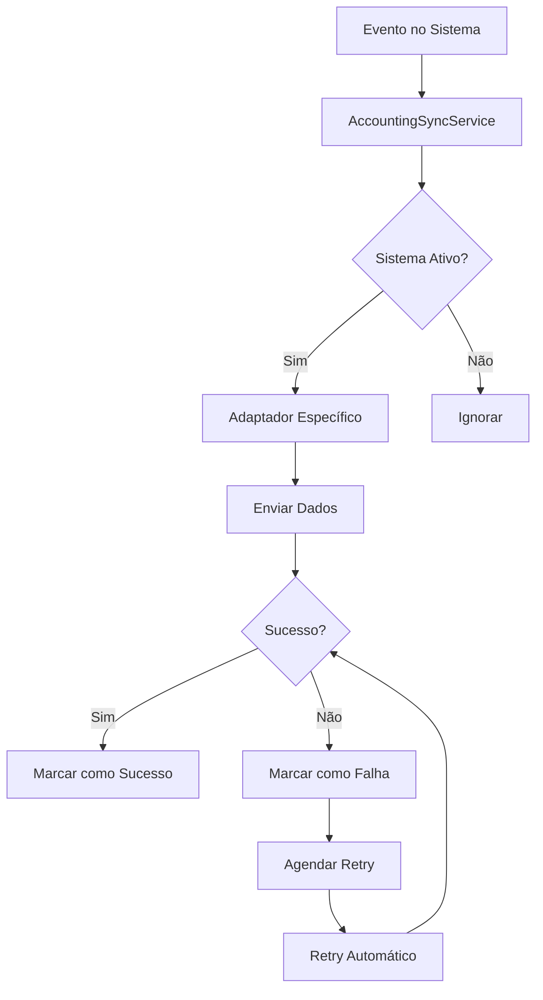

# Implementação de Sincronização Contábil

## Visão Geral

Este documento descreve a implementação do sistema de sincronização com sistemas contábeis no InterAlpha. O sistema permite integração automática com diferentes plataformas contábeis como Omie ERP, Contabilizei, Sage e sistemas genéricos via API REST.

## Arquitetura

### Componentes Principais

1. **AccountingAdapter** - Interface base para adaptadores
2. **OmieAdapter** - Adaptador específico para Omie ERP
3. **GenericAdapter** - Adaptador genérico para APIs REST
4. **AccountingSyncService** - Serviço principal de sincronização
5. **APIs REST** - Endpoints para gerenciamento
6. **Interface React** - Componente de configuração

### Fluxo de Sincronização



## Estrutura de Arquivos

```
src/
├── types/
│   └── accounting.ts                    # Tipos TypeScript
├── services/
│   └── accounting/
│       ├── accounting-adapter.ts        # Interface base
│       ├── omie-adapter.ts             # Adaptador Omie
│       ├── generic-adapter.ts          # Adaptador genérico
│       └── accounting-sync-service.ts  # Serviço principal
├── app/api/accounting/
│   ├── systems/
│   │   ├── route.ts                    # CRUD sistemas
│   │   └── [systemId]/
│   │       ├── route.ts                # Sistema específico
│   │       └── test/route.ts           # Teste conectividade
│   ├── sync/
│   │   ├── route.ts                    # Sincronizações
│   │   └── retry/route.ts              # Reprocessamento
│   └── conflicts/
│       ├── route.ts                    # Conflitos
│       └── [conflictId]/resolve/route.ts # Resolução
└── components/
    └── accounting/
        └── accounting-systems-manager.tsx # Interface React
```

## Modelos de Dados

### AccountingSystem
```typescript
interface AccountingSystem {
  id: string
  name: string
  type: 'omie' | 'contabilizei' | 'sage' | 'generic'
  baseUrl: string
  apiKey: string
  isActive: boolean
  config: Record<string, any>
}
```

### AccountingSync
```typescript
interface AccountingSync {
  id: string
  entityType: 'payment' | 'invoice' | 'expense'
  entityId: string
  systemId: string
  externalId?: string
  status: 'pending' | 'success' | 'failed' | 'conflict'
  lastSyncAt?: Date
  errorMessage?: string
  retryCount: number
  nextRetryAt?: Date
}
```

### AccountingConflict
```typescript
interface AccountingConflict {
  id: string
  syncId: string
  localData: any
  externalData: any
  conflictFields: string[]
  resolution?: 'use_local' | 'use_external' | 'merge' | 'manual'
  resolvedData?: any
  resolvedBy?: string
  resolvedAt?: Date
  notes?: string
}
```

## Adaptadores

### Interface Base (AccountingAdapter)

Todos os adaptadores implementam métodos padrão:

- `testConnection()` - Testa conectividade
- `syncPayment(payment)` - Sincroniza pagamento
- `syncInvoice(invoice)` - Sincroniza fatura
- `syncExpense(expense)` - Sincroniza despesa
- `handleConflict(conflict)` - Resolve conflitos
- `getExternalData(type, id)` - Busca dados externos

### Adaptador Omie (OmieAdapter)

Integração específica com Omie ERP:

```typescript
const omieAdapter = new OmieAdapter(appKey, appSecret, config)

// Sincronizar pagamento
const result = await omieAdapter.syncPayment({
  id: 'payment-123',
  valor: 50000, // R$ 500,00 em centavos
  descricao: 'Pagamento de serviços',
  data: new Date(),
  clienteId: 'client-456'
})
```

### Adaptador Genérico (GenericAdapter)

Para sistemas com API REST padrão:

```typescript
const genericAdapter = new GenericAdapter(apiKey, baseUrl, {
  endpoints: {
    payments: '/payments',
    invoices: '/invoices',
    expenses: '/expenses'
  },
  defaultPaymentCategory: 'services',
  conflictResolution: 'local_wins'
})
```

## Serviço de Sincronização

### Inicialização

```typescript
const syncService = new AccountingSyncService({
  autoSync: true,
  syncInterval: 60, // minutos
  maxRetries: 3,
  retryDelay: 30, // minutos
  conflictResolution: 'manual',
  enabledEntities: ['payment', 'invoice']
})

await syncService.initializeAdapters()
```

### Sincronização Manual

```typescript
// Sincronizar pagamento específico
const results = await syncService.syncPayment(paymentData)

// Sincronizar fatura específica
const results = await syncService.syncInvoice(invoiceData)
```

### Reprocessamento Automático

```typescript
// Reprocessar todas as sincronizações falhadas
await syncService.retryFailedSyncs()

// Resolver conflitos automaticamente
await syncService.resolveConflicts()
```

## APIs REST

### Sistemas Contábeis

#### Listar Sistemas
```http
GET /api/accounting/systems
```

#### Criar Sistema
```http
POST /api/accounting/systems
Content-Type: application/json

{
  "name": "Contabilidade Principal",
  "type": "omie",
  "apiKey": "your-api-key",
  "config": {
    "appKey": "your-app-key",
    "appSecret": "your-app-secret"
  }
}
```

#### Testar Conectividade
```http
POST /api/accounting/systems/{systemId}/test
```

### Sincronizações

#### Listar Sincronizações
```http
GET /api/accounting/sync?entityType=payment&status=failed&page=1&limit=20
```

#### Sincronizar Entidade
```http
POST /api/accounting/sync
Content-Type: application/json

{
  "entityType": "payment",
  "entityId": "payment-123",
  "systemIds": ["system-456"]
}
```

#### Reprocessar Falhas
```http
POST /api/accounting/sync/retry
Content-Type: application/json

{
  "syncIds": ["sync-123", "sync-456"]
}
```

### Conflitos

#### Listar Conflitos
```http
GET /api/accounting/conflicts?resolved=false&page=1&limit=20
```

#### Resolver Conflito
```http
POST /api/accounting/conflicts/{conflictId}/resolve
Content-Type: application/json

{
  "resolution": "use_local",
  "notes": "Dados locais estão mais atualizados"
}
```

## Interface de Usuário

### Componente Principal

O componente `AccountingSystemsManager` fornece:

1. **Aba Sistemas**
   - Lista de sistemas configurados
   - Adicionar/editar/remover sistemas
   - Ativar/desativar sistemas
   - Testar conectividade

2. **Aba Sincronizações**
   - Histórico de sincronizações
   - Status e erros
   - Reprocessar falhas
   - Filtros por tipo e status

### Uso do Componente

```tsx
import { AccountingSystemsManager } from '@/components/accounting/accounting-systems-manager'

export default function ConfigPage() {
  return (
    <div className="container mx-auto py-6">
      <AccountingSystemsManager />
    </div>
  )
}
```

## Configuração

### Variáveis de Ambiente

```env
# Omie ERP
OMIE_APP_KEY=your_omie_app_key
OMIE_APP_SECRET=your_omie_app_secret

# Sistema Genérico
GENERIC_ACCOUNTING_API_URL=https://api.contabil.com/v1
GENERIC_ACCOUNTING_API_KEY=your_api_key

# Configurações de Sync
ACCOUNTING_SYNC_INTERVAL=60
ACCOUNTING_MAX_RETRIES=3
ACCOUNTING_RETRY_DELAY=30
```

### Configuração do Sistema

```typescript
// Configuração para Omie
const omieConfig = {
  appKey: process.env.OMIE_APP_KEY,
  appSecret: process.env.OMIE_APP_SECRET,
  defaultPaymentCategory: '1.01.01',
  defaultExpenseCategory: '3.01.01'
}

// Configuração para sistema genérico
const genericConfig = {
  endpoints: {
    payments: '/api/v1/payments',
    invoices: '/api/v1/invoices',
    expenses: '/api/v1/expenses'
  },
  customHeaders: {
    'X-API-Version': '1.0'
  },
  conflictResolution: 'local_wins'
}
```

## Tratamento de Erros

### Tipos de Erro

1. **Erro de Conectividade** - Falha na comunicação com API
2. **Erro de Autenticação** - Credenciais inválidas
3. **Erro de Validação** - Dados inválidos
4. **Erro de Conflito** - Dados divergentes

### Estratégias de Recuperação

1. **Retry Automático** - Para erros temporários
2. **Backoff Exponencial** - Aumenta intervalo entre tentativas
3. **Dead Letter Queue** - Para erros persistentes
4. **Resolução Manual** - Para conflitos complexos

### Logs e Auditoria

```typescript
// Log de sincronização
await prisma.accountingSyncLog.create({
  data: {
    syncId: sync.id,
    action: 'sync_failed',
    details: {
      error: error.message,
      retryCount: sync.retryCount,
      nextRetryAt: nextRetryDate
    }
  }
})
```

## Testes

### Script de Teste

Execute o script de teste completo:

```bash
node scripts/test-accounting-sync.js
```

### Testes Unitários

```typescript
describe('AccountingSyncService', () => {
  it('should sync payment successfully', async () => {
    const service = new AccountingSyncService(config)
    await service.initializeAdapters()
    
    const result = await service.syncPayment(mockPayment)
    
    expect(result[0].status).toBe('success')
    expect(result[0].externalId).toBeDefined()
  })
})
```

### Testes de Integração

```typescript
describe('Omie Integration', () => {
  it('should connect to Omie API', async () => {
    const adapter = new OmieAdapter(appKey, appSecret)
    const connected = await adapter.testConnection()
    
    expect(connected).toBe(true)
  })
})
```

## Monitoramento

### Métricas Importantes

1. **Taxa de Sucesso** - % de sincronizações bem-sucedidas
2. **Tempo de Resposta** - Latência das APIs externas
3. **Conflitos** - Número de conflitos por período
4. **Retries** - Tentativas de reprocessamento

### Alertas

Configure alertas para:

- Taxa de falha > 10%
- Tempo de resposta > 30s
- Conflitos não resolvidos > 24h
- Sistema inativo por > 1h

## Segurança

### Proteção de Credenciais

- Armazenar chaves de API criptografadas
- Usar variáveis de ambiente para configurações sensíveis
- Implementar rotação de chaves

### Auditoria

- Log de todas as operações de sincronização
- Rastreamento de alterações em dados
- Controle de acesso baseado em roles

## Performance

### Otimizações

1. **Processamento Assíncrono** - Usar filas para sincronizações
2. **Batch Processing** - Agrupar múltiplas operações
3. **Caching** - Cache de dados frequentemente acessados
4. **Connection Pooling** - Reutilizar conexões HTTP

### Limites

- Máximo 100 sincronizações por minuto
- Timeout de 30 segundos por requisição
- Máximo 3 tentativas de retry
- Retenção de logs por 90 dias

## Troubleshooting

### Problemas Comuns

1. **Falha de Conectividade**
   - Verificar credenciais
   - Testar conectividade de rede
   - Validar URLs de API

2. **Dados Rejeitados**
   - Verificar formato dos dados
   - Validar campos obrigatórios
   - Conferir mapeamento de campos

3. **Conflitos Frequentes**
   - Revisar estratégia de resolução
   - Sincronizar com mais frequência
   - Implementar validação prévia

### Comandos Úteis

```bash
# Testar conectividade
curl -X POST http://localhost:3000/api/accounting/systems/{id}/test

# Reprocessar falhas
curl -X POST http://localhost:3000/api/accounting/sync/retry

# Verificar status
curl http://localhost:3000/api/accounting/sync?status=failed
```

## Roadmap

### Próximas Funcionalidades

1. **Novos Adaptadores**
   - Contabilizei
   - Sage
   - QuickBooks

2. **Melhorias**
   - Sincronização bidirecional
   - Webhooks para atualizações em tempo real
   - Dashboard de métricas
   - Notificações por email

3. **Integrações**
   - Sistema de backup
   - Relatórios avançados
   - API externa para terceiros