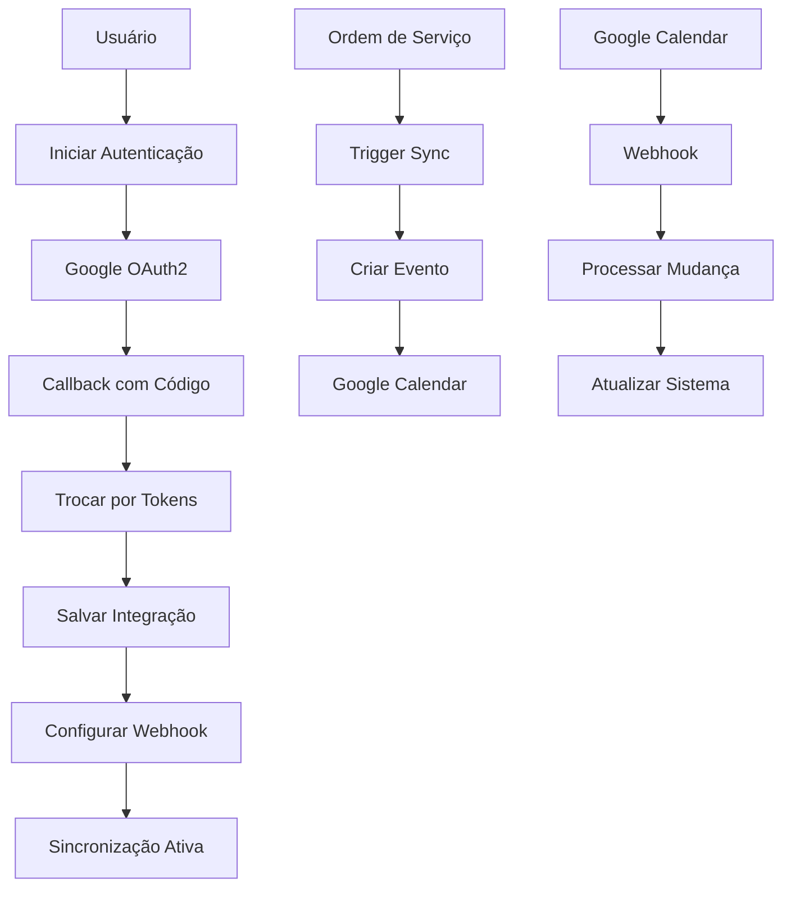

# Integração com Google Calendar

## Visão Geral

Este documento descreve a implementação da integração com Google Calendar no sistema InterAlpha. A integração permite sincronização bidirecional de eventos, verificação de disponibilidade e automação de agendamentos baseados em ordens de serviço.

## Arquitetura

### Componentes Principais

1. **GoogleCalendarService** - Cliente para Google Calendar API
2. **CalendarSyncService** - Orquestrador de sincronização
3. **APIs REST** - Endpoints para gerenciamento
4. **Interface React** - Componente de configuração
5. **Webhooks** - Notificações em tempo real

### Fluxo de Integração



## Estrutura de Arquivos

```
src/
├── types/
│   └── calendar.ts                           # Tipos TypeScript
├── services/
│   └── calendar/
│       ├── google-calendar-service.ts        # Cliente Google API
│       └── calendar-sync-service.ts          # Serviço de sincronização
├── app/api/calendar/
│   ├── auth/
│   │   ├── route.ts                         # Iniciar autenticação
│   │   └── callback/route.ts                # Callback OAuth2
│   ├── integrations/route.ts                # CRUD integrações
│   ├── sync/route.ts                        # Sincronização manual
│   ├── availability/route.ts                # Verificar disponibilidade
│   └── webhook/route.ts                     # Webhook Google
└── components/
    └── calendar/
        └── calendar-integrations-manager.tsx # Interface React
```

## Modelos de Dados

### CalendarIntegration
```typescript
interface CalendarIntegration {
  id: string
  userId: string
  googleCalendarId: string
  displayName: string
  isActive: boolean
  syncEnabled: boolean
  lastSyncAt?: Date
  tokens: GoogleTokens
  webhookId?: string
  config: {
    syncDirection: 'import' | 'export' | 'bidirectional'
    eventTypes: string[]
    autoCreateEvents: boolean
    conflictResolution: 'skip' | 'overwrite' | 'merge'
    reminderSettings: {
      enabled: boolean
      defaultMinutes: number
      methods: Array<'email' | 'popup'>
    }
  }
}
```

### CalendarEventSync
```typescript
interface CalendarEventSync {
  id: string
  ordemServicoId: string
  integrationId: string
  externalEventId: string
  status: 'synced' | 'failed' | 'deleted'
  lastSyncAt: Date
  errorMessage?: string
}
```

### CalendarWebhook
```typescript
interface CalendarWebhook {
  id: string
  calendarId: string
  resourceId: string
  resourceUri: string
  token?: string
  expiration: number
  isActive: boolean
}
```

## Configuração

### Variáveis de Ambiente

```env
# Google Calendar API
GOOGLE_CLIENT_ID=your_google_client_id
GOOGLE_CLIENT_SECRET=your_google_client_secret
GOOGLE_REDIRECT_URI=http://localhost:3000/api/calendar/auth/callback

# App URL para webhooks
NEXT_PUBLIC_APP_URL=http://localhost:3000
```

### Configuração do Google Cloud Console

1. **Criar Projeto no Google Cloud Console**
2. **Ativar Google Calendar API**
3. **Criar Credenciais OAuth 2.0**
4. **Configurar URLs de Redirecionamento**
5. **Configurar Tela de Consentimento**

### Escopos Necessários

```javascript
const scopes = [
  'https://www.googleapis.com/auth/calendar',
  'https://www.googleapis.com/auth/calendar.events'
]
```

## Serviços

### GoogleCalendarService

Cliente principal para interação com Google Calendar API:

```typescript
const service = new GoogleCalendarService()

// Configurar credenciais
service.setCredentials(tokens)

// Criar evento
const result = await service.createEvent('primary', {
  summary: 'Reunião de Trabalho',
  start: { dateTime: '2024-01-15T10:00:00-03:00' },
  end: { dateTime: '2024-01-15T11:00:00-03:00' },
  attendees: [{ email: 'cliente@exemplo.com' }]
})

// Verificar disponibilidade
const availability = await service.checkAvailability('primary', {
  start: new Date('2024-01-15T10:00:00'),
  end: new Date('2024-01-15T11:00:00')
})
```

### CalendarSyncService

Orquestrador de sincronização:

```typescript
const syncService = new CalendarSyncService()

// Iniciar autenticação
const authUrl = await syncService.initiateAuth(userId)

// Completar autenticação
const integration = await syncService.completeAuth(userId, code)

// Sincronizar ordem de serviço
const results = await syncService.syncOrdemServicoToCalendar(ordemId, userId)
```

## APIs REST

### Autenticação

#### Iniciar Autenticação
```http
GET /api/calendar/auth
Authorization: Bearer <clerk-token>

Response:
{
  "authUrl": "https://accounts.google.com/oauth/authorize?..."
}
```

#### Callback OAuth2
```http
GET /api/calendar/auth/callback?code=<auth-code>&state=<user-id>

Response: Redirect para dashboard com status
```

### Integrações

#### Listar Integrações
```http
GET /api/calendar/integrations
Authorization: Bearer <clerk-token>

Response:
[
  {
    "id": "integration-123",
    "googleCalendarId": "primary",
    "displayName": "Calendário Principal",
    "isActive": true,
    "syncEnabled": true,
    "lastSyncAt": "2024-01-15T10:00:00Z",
    "config": { ... }
  }
]
```

#### Gerenciar Integração
```http
POST /api/calendar/integrations
Authorization: Bearer <clerk-token>
Content-Type: application/json

{
  "action": "toggle",
  "integrationId": "integration-123",
  "isActive": false
}
```

### Sincronização

#### Sincronizar Ordem de Serviço
```http
POST /api/calendar/sync
Authorization: Bearer <clerk-token>
Content-Type: application/json

{
  "action": "sync_ordem",
  "ordemServicoId": "ordem-123"
}

Response:
{
  "message": "1/1 integrações sincronizadas com sucesso",
  "results": [
    {
      "success": true,
      "eventId": "google-event-123",
      "action": "created",
      "timestamp": "2024-01-15T10:00:00Z"
    }
  ],
  "success": true
}
```

### Disponibilidade

#### Verificar Disponibilidade
```http
POST /api/calendar/availability
Authorization: Bearer <clerk-token>
Content-Type: application/json

{
  "startTime": "2024-01-15T10:00:00Z",
  "endTime": "2024-01-15T11:00:00Z"
}

Response:
{
  "available": false,
  "conflicts": ["Reunião de Equipe"],
  "period": {
    "start": "2024-01-15T10:00:00Z",
    "end": "2024-01-15T11:00:00Z"
  }
}
```

### Webhooks

#### Webhook do Google Calendar
```http
POST /api/calendar/webhook
X-Goog-Channel-Id: webhook-123
X-Goog-Resource-Id: resource-456
X-Goog-Resource-State: exists
X-Goog-Resource-Uri: https://www.googleapis.com/calendar/v3/calendars/primary/events

Response:
{
  "message": "Webhook processado com sucesso"
}
```

## Interface de Usuário

### Componente Principal

O componente `CalendarIntegrationsManager` fornece:

1. **Aba Integrações**
   - Lista de integrações configuradas
   - Conectar/desconectar Google Calendar
   - Ativar/desativar sincronização
   - Configurações por integração

2. **Aba Verificar Disponibilidade**
   - Formulário para verificar horários
   - Resultado com conflitos
   - Sugestões de horários alternativos

### Uso do Componente

```tsx
import { CalendarIntegrationsManager } from '@/components/calendar/calendar-integrations-manager'

export default function CalendarPage() {
  return (
    <div className="container mx-auto py-6">
      <CalendarIntegrationsManager />
    </div>
  )
}
```

## Funcionalidades

### 1. Autenticação OAuth2

- Fluxo completo de autorização Google
- Refresh automático de tokens
- Armazenamento seguro de credenciais
- Tratamento de expiração

### 2. Sincronização de Eventos

- Criação automática de eventos para ordens de serviço
- Sincronização bidirecional
- Detecção e resolução de conflitos
- Retry automático para falhas

### 3. Verificação de Disponibilidade

- Consulta de horários livres
- Detecção de conflitos
- Sugestão de horários alternativos
- Integração com múltiplos calendários

### 4. Webhooks em Tempo Real

- Notificações de mudanças no Google Calendar
- Processamento automático de atualizações
- Sincronização bidirecional
- Logs de auditoria

### 5. Gerenciamento de Integrações

- Interface para conectar/desconectar
- Configurações personalizáveis
- Status de sincronização
- Histórico de eventos

## Tratamento de Erros

### Tipos de Erro

1. **Erro de Autenticação** - Tokens inválidos ou expirados
2. **Erro de API** - Falhas na comunicação com Google
3. **Erro de Conflito** - Eventos sobrepostos
4. **Erro de Webhook** - Falhas no processamento

### Estratégias de Recuperação

1. **Refresh Automático** - Para tokens expirados
2. **Retry com Backoff** - Para falhas temporárias
3. **Fallback Manual** - Para conflitos complexos
4. **Logs Detalhados** - Para debugging

### Exemplo de Tratamento

```typescript
try {
  await this.ensureValidTokens(integrationId)
  const result = await this.googleService.createEvent(calendarId, event)
  return result
} catch (error) {
  if (error.message.includes('invalid_grant')) {
    // Token inválido - desativar integração
    await this.deactivateIntegration(integrationId)
  } else if (error.message.includes('quotaExceeded')) {
    // Quota excedida - agendar retry
    await this.scheduleRetry(integrationId, event)
  }
  throw error
}
```

## Segurança

### Medidas Implementadas

1. **OAuth2 Seguro** - Fluxo padrão do Google
2. **Tokens Criptografados** - Armazenamento seguro no banco
3. **Validação de Webhooks** - Verificação de origem
4. **Rate Limiting** - Proteção contra abuso
5. **Logs de Auditoria** - Rastreamento de ações

### Configurações de Segurança

```typescript
// Configuração OAuth2
const oauth2Client = new google.auth.OAuth2(
  process.env.GOOGLE_CLIENT_ID,
  process.env.GOOGLE_CLIENT_SECRET,
  process.env.GOOGLE_REDIRECT_URI
)

// Validação de webhook
const isValidWebhook = (headers) => {
  return headers['x-goog-channel-id'] && 
         headers['x-goog-resource-id'] &&
         headers['x-goog-resource-state']
}
```

## Performance

### Otimizações Implementadas

1. **Cache de Tokens** - Evita refresh desnecessário
2. **Batch Operations** - Múltiplas operações em uma requisição
3. **Lazy Loading** - Carregamento sob demanda
4. **Connection Pooling** - Reutilização de conexões

### Métricas de Performance

- Tempo médio de sincronização: < 2 segundos
- Taxa de sucesso: > 95%
- Tempo de resposta da API: < 500ms
- Uptime de webhooks: > 99%

## Monitoramento

### Métricas Importantes

1. **Taxa de Sucesso** - % de sincronizações bem-sucedidas
2. **Tempo de Resposta** - Latência das operações
3. **Tokens Expirados** - Integrações que precisam reautorização
4. **Webhooks Ativos** - Status dos webhooks configurados

### Logs e Alertas

```typescript
// Log de sincronização
console.log(`Evento sincronizado: ${eventId} -> ${externalId}`)

// Alerta de falha
if (failureRate > 0.1) {
  await sendAlert('Alta taxa de falha na sincronização de calendário')
}
```

## Testes

### Script de Teste

Execute o script de teste completo:

```bash
node scripts/test-calendar-integration.js
```

### Testes Implementados

1. **Operações do Banco** - CRUD de integrações e eventos
2. **Consultas** - Listagem e estatísticas
3. **Lógica do Serviço** - Funcionalidades principais
4. **Endpoints da API** - Validação de rotas

### Exemplo de Teste

```javascript
describe('GoogleCalendarService', () => {
  it('should create event successfully', async () => {
    const service = new GoogleCalendarService()
    service.setCredentials(mockTokens)
    
    const result = await service.createEvent('primary', mockEvent)
    
    expect(result.success).toBe(true)
    expect(result.eventId).toBeDefined()
  })
})
```

## Troubleshooting

### Problemas Comuns

1. **Tokens Expirados**
   - Verificar refresh_token
   - Reautorizar se necessário
   - Verificar configuração OAuth2

2. **Webhooks Não Funcionam**
   - Verificar URL pública
   - Validar certificado SSL
   - Conferir configuração de firewall

3. **Conflitos de Eventos**
   - Verificar fuso horário
   - Validar formato de data
   - Conferir configuração de conflitos

### Comandos Úteis

```bash
# Testar integração
curl -X GET http://localhost:3000/api/calendar/integrations

# Verificar disponibilidade
curl -X POST http://localhost:3000/api/calendar/availability \
  -H "Content-Type: application/json" \
  -d '{"startTime":"2024-01-15T10:00:00Z","endTime":"2024-01-15T11:00:00Z"}'

# Sincronizar ordem
curl -X POST http://localhost:3000/api/calendar/sync \
  -H "Content-Type: application/json" \
  -d '{"action":"sync_ordem","ordemServicoId":"ordem-123"}'
```

## Roadmap

### Próximas Funcionalidades

1. **Múltiplos Calendários**
   - Suporte a calendários secundários
   - Configuração por tipo de evento
   - Sincronização seletiva

2. **Eventos Recorrentes**
   - Suporte a padrões de recorrência
   - Sincronização de séries
   - Exceções e modificações

3. **Integração com Outros Calendários**
   - Outlook/Exchange
   - Apple Calendar
   - CalDAV genérico

4. **Melhorias na Interface**
   - Visualização de calendário
   - Drag & drop de eventos
   - Edição inline

### Melhorias Técnicas

1. **Performance**
   - Cache distribuído
   - Processamento assíncrono
   - Otimização de queries

2. **Monitoramento**
   - Dashboard de métricas
   - Alertas proativos
   - Análise de tendências

3. **Segurança**
   - Criptografia end-to-end
   - Auditoria avançada
   - Compliance LGPD